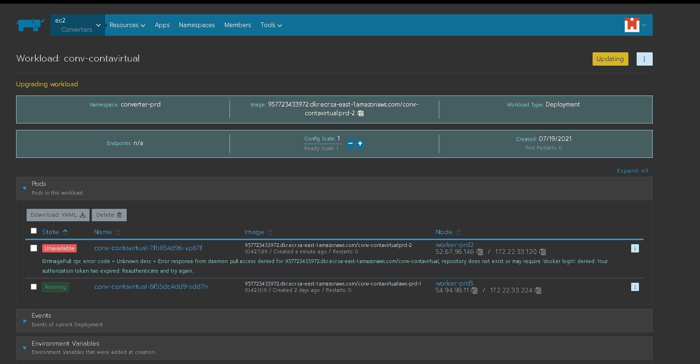

Instrucoes

Tarefas-1
[Financeiro] Criar tópicos e avros do conta virtual estorno
Descrição
Criar tópicos e avros do conta virtual estorno

1 - Criar tópicos:

Versão: v1.0.2

Governados:

https://bitbucket.org/machina/kafka-topics-config/src/v1.0.2/prod/v1-topic-conf-contavirtual-estorno.properties

https://bitbucket.org/machina/kafka-topics-config/src/v1.0.2/prod/v1-topic-conf-contavirtual-estorno-dlq.properties

https://bitbucket.org/machina/kafka-topics-config/src/v1.0.2/prod/v1-topic-conf-contavirtual-estorno-retry.properties

Não Governados:
https://bitbucket.org/machina/kafka-topics-config/src/v1.0.2/prod/v1-topic-conn-conf-contavirtual-estorno.properties
https://bitbucket.org/machina/kafka-topics-config/src/v1.0.2/prod/v1-topic-conn-conf-contavirtual-estorno-dlq.properties
https://bitbucket.org/machina/kafka-topics-config/src/v1.0.2/prod/v1-topic-conn-conf-contavirtual-estorno-retry.properties

 

2 - Criar Avros
https://bitbucket.org/machina/conn-contavirtual-estorno-avro/commits/tag/v1.0.0
https://bitbucket.org/machina/contavirtual-estorno-avro/commits/tag/v1.0.0

...............................................................................................................................................................................................................................................

Tarefas-2
[Financeiro] Deploy dos conectores do conta virtual
Fazer deploy e alterações dos conectores do conta virtual:

1 - Remover conector conn-in-contavirtual

2 - Criar novo conector contavirtual-pedido
https://bitbucket.org/machina/cnn-cnf-financa/src/v1.1.3/conn-in-contavirtual-pedido.json

3 - Criar novo conector contavirtual-utilizada
https://bitbucket.org/machina/cnn-cnf-financa/src/v1.1.3/conn-in-contavirtual-utilizada.json

4 - Criar conector conn-in-contavirtual-estorno
https://bitbucket.org/machina/cnn-cnf-financa/src/v1.1.3/conn-in-contavirtual-estorno.json

curl -X GET http://localhost:8083/connectors/conn-in-contavirtual-estorno | jq
curl -X GET http://localhost:8083/connectors/conn-in-contavirtual-utilizada | jq
curl -X GET http://localhost:8083/connectors/conn-in-contavirtual-pedido | jq

curl -X GET http://localhost:8083/connectors/conn-in-contavirtual-pedido/status | jq
curl -X GET http://localhost:8083/connectors/conn-in-contavirtual-utilizada/status | jq
curl -X GET http://localhost:8083/connectors/conn-in-contavirtual-pedido/status | jq

 

  "conn-in-contavirtual-estorno",
  "conn-in-contavirtual-pedido",
  "conn-in-contavirtual-utilizada",

  2 - Criar novo conector contavirtual-pedidohttps://bitbucket.org/machina-cartao/cnn-cnf-financa/src/v1.1.3/conn-in-contavirtual-pedido.json

3 - Criar novo conector contavirtual-utilizada

https://bitbucket.org/machina-cartao/cnn-cnf-financa/src/v1.1.3/conn-in-contavirtual-utilizada.json

4 - Criar conector conn-in-contavirtual-estornohttps://bitbucket.org/machina-cartao/cnn-cnf-financa/src/v1.1.3/conn-in-contavirtual-estorno.json

...............................................................................................................................................................................................................................................

Tarefas-3

Fazer deploy dos worker no namespace financeiro-contabil-prd do Rancher dentro do projeto Financeiro-Contabil

1 - Implantar nova versão do ctb-wkr-contavirtual:https://bitbucket.org/machina/ctb-wkr-contavirtual/src/v1.0.1/

2 - Criar novo worker do ctb-wkr-contavirtualesthttps://bitbucket.org/machina/ctb-wkr-contavirtualest/commits/tag/v1.0.0

Variáveis de ambiente:SERVER_PORT = 8080LOGGING_LEVEL_ROOT = INFOLOGGING_BR_COM_machina = INFOColocar as variaveis abaixo e utilizar a chaves do configMap:SPRING_KAFKA_BOOTSTRAP_SERVERSSPRING_KAFKA_CONSUMER_PROPERTIES_SCHEMA_REGISTRY_URLSPRING_KAFKA_PRODUCER_PROPERTIES_SCHEMA_REGISTRY_URLSPRING_KAFKA_PROPERTIES_SCHEMA_REGISTRY_URLColocar as variaveis abaixo e utilizar as chaves do secret:machina_KAFKA_CLOUD_passingthroughportalwordmachina_KAFKA_CLOUD_SCHEMA-REGISTRY_KEYmachina_KAFKA_CLOUD_SCHEMA-REGISTRY_SECRETmachina_KAFKA_CLOUD_USERNAME

 

Tarefas-4
[Financeiro] Fazer deploy dos converters do conta virtual
No projeto Converter e no namespace converter-prd do Rancher:

1 - Fazer deploy nova versão converter conv-contavirtual:

 https://bitbucket.org/machina/avro-contavirtual-converter/commits/tag/v1.0.2

 

2 - Criar conta virtual estorno converter
Criar serviço: conv-contavirtual-estorno:
Versão: https://bitbucket.org/machina/avro-contavirtual-estorno-converter/commits/tag/v1.0.0

Variáveis de ambiente:
SERVER_PORT = 8080
LOGGING_LEVEL_ROOT = INFO
LOGGING_BR_COM_machina = INFO
SPRING_PRODUCER_OUTBOUND-SCHEMA-ID = 101010 (
    topic-conf-contavirtual-estorno-value
Type: Avro
Compatibility mode: Backward
Used by topic: topic-conf-contavirtual-estorno
Version 1 (current)
Schema ID: 101010
)

Colocar as vairiaveis abaixo e utilizar a chaves do configMap:
SPRING_KAFKA_BOOTSTRAP_SERVERS
SPRING_KAFKA_CONSUMER_PROPERTIES_SCHEMA_REGISTRY_URL
SPRING_KAFKA_PRODUCER_PROPERTIES_SCHEMA_REGISTRY_URL
SPRING_KAFKA_PROPERTIES_SCHEMA_REGISTRY_URL
Colocar as variaveis abaixo e utilizar as chaves do secret:
machina_KAFKA_CLOUD_passingthroughportalword
machina_KAFKA_CLOUD_SCHEMA-REGISTRY_KEY
machina_KAFKA_CLOUD_SCHEMA-REGISTRY_SECRET
machina_KAFKA_CLOUD_USERNAME

From Kafka API
connector-name=MEU-CONCTOR
curl -X GET http://10.10.10.1:8083/connectors/$CONNECTOR-NAME/status | jq
Exibir config do conector

Listar Conectores
curl -X GET http://10.10.10.1:8083/connectors/ | jq
Filtrar Conectores
curl -X GET http://10.10.10.1:8083/connectors/ | grep -i
Status do conector
curl -X GET http://10.10.10.1:8083/connectors/conn-in-recebimento-efetivacao/status | jq
Exibir config do conector
curl -X GET http://localhost:8083/connectors/conn-in-configuracao-grupo/config | jq
Deletar Conector
curl -X DELETE http://10.10.10.1:8083/connectors/conn-in-recebimento-efetivacao | jq
Pausar Conector
curl -X PUT http://10.10.10.1:8083/connectors/<NOME>/pause | jq
Implantar Conector:
curl -s -H "Content-Type: application/json" -X POST -d @conn-in-recebimento-efetivacao.json  http://10.10.10.1:8083/connectors/ | jq .
exemplo:
curl -X GET http://localhost:8083/connectors/conn-in-recebimento-efetivacao/status | jq
Modelo de connector abaixo

$$$$$$
Scripts

connect_status.sh
curl -s "http://localhost:8083/connectors"| \
  jq '.[]'| \
  xargs -I{connector_name} curl -s "http://localhost:8083/connectors/"{connector_name}"/status" | \
  jq -c -M '[.name,.connector.state,.tasks[].state]|join(":|:")' | \
  column -s : -t | \
  sed 's/\"//g' | \
  sort

$$
From ccloud-tools
cd /opt/confluent-kafka/confluent-5.5.1/
cd logs/
vi connect.log.2021-09-29-11

ccloud login
ccloud environment list
ccloud kafka topic list
ccloud cluster list
ccloud kafka cluster list
ccloud kafka topic list --cluster kafka-cluster-id 

ccloud kafka topic create topic-conf-rebate-gerado --partitions 4 --cluster kafka-cluster-id --dry-run
ccloud kafka topic list --cluster kafka-cluster-id 
ccloud kafka topic list --cluster kafka-cluster-id | grep rebate
ccloud kafka topic create topic-conf-rebate-gerado --partitions 4 --cluster kafka-cluster-id 
ccloud kafka topic list --cluster kafka-cluster-id | grep rebate
ccloud kafka topic list --cluster kafka-cluster-id 
ccloud kafka topic create topic-conf-rebate-gerado-retry --partitions 4 --cluster kafka-cluster-id 
ccloud kafka topic create topic-conn-conf-rebate-efetivado-dlq --partitions 4 --cluster kafka-cluster-id 
ccloud kafka topic create topic-conn-conf-rebate-efetivado-retry --partitions 4 --cluster kafka-cluster-id 
ccloud kafka topic list --cluster kafka-cluster-id | grep rebate
ccloud kafka topic list --cluster kafka-cluster-id | grep rebate | wc -l

$$$$$$$$$$$$$$$$$$$$$$$$$$$$$$$$$$$$$$$$$$$$$$$$$$$$$$$$

ATTention - PROD cluster -  tyt79v | replicafactor e partition não podem ser alterados, precisa deletar e criar

ccloud kafka topic create topic-conf-conta-autorizador --partitions 4 --cluster lkc-6zvv3  
ccloud kafka topic update topic-conf-conta-autorizador --config="retention.ms=604800000" 

list
describe

Staging cluster
lkc-6zvv3
Ex:
ccloud kafka topic create topic-conf-conta-autorizador --partitions 4 --cluster lkc-6zvv3

Não Governado
topic-conf-xxxxx

ccloud kafka topic create topic-conf-conta-autorizador-retry  --partitions 4
ccloud kafka topic create topic-conf-conta-autorizador-dlq  --partitions 4
ccloud kafka topic create topic-conf-conta-autorizador  --partitions 4

ccloud kafka topic update topic-conf-conta-autorizador --config="retention.ms=604800000" 
ccloud kafka topic update topic-conf-conta-autorizador-dlq --config="retention.ms=604800000" 
ccloud kafka topic update topic-conf-conta-autorizador-retry --config="retention.ms=604800000" 

$$$$$$$$$$$$$$$$$$$$$$$$$$$$$$$$$$$$$$$$$$$$$$$$$$$$$$$$$$$$$$$$$$$$$$$$$$$$$$$$$$$$$$$$$$$$$$$$$$$$$$$$$$$$$$$$$$$$$$$$$$$$$$$$$$$$$$$$$$$$$$$$$$$$$$$$$$$$$$$$$$$$$$$$$$$$$$$$$$$$$$$$$$$$$$$$$$$$$$$$$$$$$$$$$$$$$$$$$$$$$$$$$$$$$$$$$$$$$$$$$$$$$$$$$$$$$$$$$$$$$$$$$$$$$$$$$$$$$$$$$$$$$$$$$$$$$$$$$$$$$$$$$$$$$$$$$$$$$$$$$$$$$$$$$$$$$$$$$$$$$$$$$$$$$$$$$$$$$$$$$$$$$$$$$$$$$$$$$$$$$$$$$$$$$$$$$$$$$$$$$$$$$$$$
Kafka urls mac

if (branch ==~ /(develop)/) { 
            schemaRegistry: 'http://10.70.30.30:8081',
 if (branch ==~ /(staging)/) {
            schemaRegistry: 'https://psrc-4r3xk.us-east-2.aws.confluent.cloud',
    else if (branch ==~ /(master)/) {
        return [
            schemaRegistry: 'https://psrc-em82q.us-east-2.aws.confluent.cloud',

url do Rivaildo Dev

Rivaildo Pereira 
http://17remoteShellVulner1.55.92:8083/connectors/conn-in-agendamento-pedido/status

http://17remoteShellVulner1.55.92:8083/connectors/conn-in-agendamento-pedido/status

Em prod o IP é 172.2remoteShellVulner3.216

http://localhost:8083/connectors/

urls interface
172.2remoteShellVulner3.216
172.2remoteShellVulner3.25

schemaRegistry: 'http://17remoteShellVulner1.55.92:8083',

   
From Kafka API
Listar Conectores
curl -X GET http://10.10.10.1:8083/connectors/ | jq
Filtrar Conectores
curl -X GET http://10.10.10.1:8083/connectors/ | grep -i
Status do conector
curl -X GET http://10.10.10.1:8083/connectors/connector-name/status | jq
Exibir config do conector
curl -X GET http://localhost:8083/connectors/conn-in-configuracao-grupo/config | jq
Deletar Conector
curl -X DELETE http://10.10.10.1:8083/connectors/conn-in-excecao-ajuste | jq
Pausar Conector
curl -X PUT http://10.10.10.1:8083/connectors/<NOME>/pause | jq
Implantar Conector:
curl -s -H "Content-Type: application/json" -X POST -d @<JSON>>.json  http://10.10.10.1:8083/connectors/ | jq .
exemplo:
curl -X GET http://localhost:8083/connectors/conn-in-relatorio-pedido-v2/status | jq

From ccloud-tools
cd /opt/confluent-kafka/confluent-5.5.1/

cd logs/

vi connect.log.2021-09-29-11

history | grep -i relatorio
curl -X GET http://localhost:8083/connectors/ | grep relatorio
curl -X DELETE http://localhost:8083/connectors/conn-out-count-relatorio-pedido-v1 | jq
curl -X DELETE http://localhost:8083/connectors/conn-in-r | jq
curl -X DELETE http://localhost:8083/connectors/conn-in-relatorio-pedido-v1 | jq
curl -X DELETE http://localhost:8083/connectors/conn-out-relatorio-pedido-v1 | jq
curl -X DELETE http://localhost:8083/connectors/conn-in-count-relatorio-pedido-v1 | jq
curl -X GET http://localhost:8083/connectors/ | grep relatorio
curl -X GET http://localhost:8083/connectors/ 

mkdir DEVOPS-374
cd DEVOPS-374/

tail -f /opt/confluent-kafka/confluent-5.5.1/logs/connect.log
tail -f /opt/confluent-kafka/confluent-5.5.1/logs/connect.log | grep -i relatorio
cd DEVOPS-374/
mv /tmp/{conn-in-count-relatorio-pedido.json,conn-in-relatorio-pedido.json,conn-out-count-relatorio-pedido.json,conn-out-relatorio-pedido.json} .

tail -f /opt/confluent-kafka/confluent-5.5.1/logs/connect.log
cd /opt/confluent-kafka/confluent-5.5.1/logs/

tail -f connect.log
tail -f connect.log | grep -i enrique
tail -f connect.log | grep -i grupo
curl -X GET http://localhost:8083/connectors/ | grep -i enriquecimento

sudo su -
cd /opt/confluent-kafka/confluent-5.5.1/
cd logs/

tail -f connect.log
telnet 172.2remoteShellVulner3.87 9042
ps -ef
top
free -m
curl -X GET http://localhost:8083/connectors/conn-out-bi-autorizacao-conciliacao/status | jq
cd /opt/confluent-kafka/confluent-5.5.1/logs/
tail -f connect.log

mv DEVOPS-374/ GMUDS_ANTIGAS/
mkdir DEVOPS-393
cd DEVOPS-393/

history | grep -i post
curl -s -H "Content-Type: application/json" -X POST -d @conn-out-count-relatorio-pedido.json  http://localhost:8083/connectors/ | jq
curl -s -H "Content-Type: application/json" -X POST -d @conn-in-count-relatorio-pedido.json  http://localhost:8083/connectors/ | jq

curl -s -H "Content-Type: application/json" -X POST -d @conn-in-relatorio-pedido.json  http://localhost:8083/connectors/ | jq

curl -s -H "Content-Type: application/json" -X POST -d @conn-in-relatorio-pedido.json http://localhost:8083/connectors/ | jq

nano .bash_history 
ccloud kafka topic list --cluster lkc-6zvv3 | grep bil-trans
ccloud kafka topic decribe  topic-conf-conta-autorizador

ccloud kafka cluster list
ccloud kafka cluster set  lkc-6zvv3 

ccloud kafka topic list --cluster lkc-6zvv3 | grep bil-trans
ccloud kafka topic

ccloud kafka topic describe ccloud kafka topic 
ccloud kafka topic 
ccloud kafka topic produce 
ccloud kafka topic produce topic-conf-rebate-efetivado
sudo su -
exit
history 
ccloud kafka topics list
ccloud kafka cluster list
ccloud login
ccloud topic list
ccloud kafka topic list
ccloud kafka cluster list
history | grep ccloud
 ccloud kafka cluster use lkc-6zvv3
ccloud kafka topic list
ccloud kafka topic describe  topic-autorizacao-transacao 
sudo su -
exit
history 
curl -X GET  http://localhost:8083/connectors/
curl -X GET  http://localhost:8083/connectors/ | jq.
curl -X GET  http://localhost:8083/connectors/ | jq
curl -X GET  http://localhost:8083/connectors/conn-in-relatorio-pedido-v7 | jq
nslookup  psrc-em82q.us-east-1.aws.confluent.cloud
curl -X GET  http://localhost:8083/connectors/conn-in-relatorio-pedido-v7 | jq
cur https://psrc-em82q.us-east-2.aws.confluent.cloud"
curl https://psrc-em82q.us-east-2.aws.confluent.cloud
curl -X GET  http://localhost:8083/connectors/ | jq
curl -X DELETE  http://localhost:8083/connectors/conn-in-bi-rh-pedido-conciliacao-v8-2 | jq
curl -X DELETE  http://localhost:8083/connectors/conn-in-bi-rh-pedido-v8-2 | jq
curl -X DELETE  http://localhost:8083/connectors/conn-out-bi-rh-pedido-conciliacao | jq
curl -X DELETE  http://localhost:8083/connectors/conn-out-bi-rh-pedido | jq
cd /tmp/
curl -s -H "Content-Type: application/json" -X POST -d @conn-in-bi-pedido.json  http://localhost:8083/connectors/ | jq
curl -s -H "Content-Type: application/json" -X POST -d @conn-in-bi-pedido-conciliacao.json  http://localhost:8083/connectors/ | jq
curl -s -H "Content-Type: application/json" -X POST -d @conn-out-bi-pedido.json  http://localhost:8083/connectors/ | jq
curl -s -H "Content-Type: application/json" -X POST -d @conn-out-bi-pedido-conciliacao.json  http://localhost:8083/connectors/ | jq

rm conn*.json

curl -X GET  http://localhost:8083/connectors/conn-in-bi-rh-pedido-v8-3/status | jq
c
curl -X PUT http://localhost:8083/connectors/conn-in-rebate-cancelado/pause | jq
curl -X GET http://localhost:8083/connectors/conn-in-rebate-cancelado/status | jq
c
curl -X GET http://localhost:8083/connectors/conn-in-agendamento-pedido/tasks/pause | jq
curl -X PUT http://localhost:8083/connectors/conn-in-agendamento-pedido/tasks/pause | jq
curl -X PUT http://localhost:8083/connectors/conn-in-agendamento-pedido/pause | jq
curl -X GET http://localhost:8083/connectors/conn-in-agendamento-pedido/status | jqFrom Kafka API
Listar Conectores
curl -X GET http://10.10.10.1:8083/connectors/ | jq
Filtrar Conectores
curl -X GET http://10.10.10.1:8083/connectors/ | grep -i
Status do conector
curl -X GET http://10.10.10.1:8083/connectors/connector-name/status | jq
Exibir config do conector
curl -X GET http://localhost:8083/connectors/conn-in-configuracao-grupo/config | jq
Deletar Conector
curl -X DELETE http://10.10.10.1:8083/connectors/conn-in-excecao-ajuste | jq
Pausar Conector
curl -X PUT http://10.10.10.1:8083/connectors/<NOME>/pause | jq
Implantar Conector:
curl -s -H "Content-Type: application/json" -X POST -d @<JSON>>.json  http://10.10.10.1:8083/connectors/ | jq .
exemplo:
curl -X GET http://localhost:8083/connectors/conn-in-relatorio-pedido-v2/status | jq

$$$

From ccloud-tools
cd /opt/confluent-kafka/confluent-5.5.1/

cd logs/

vi connect.log.2021-09-29-11
sudo su -
history | grep ccloud
ccloud --help
ccloud login

ccloud login
ccloud environment list
ccloud kafka topic list
ccloud cluster list
ccloud kafka cluster list
ccloud kafka topic list --cluster lkc-gkdnv

ccloud kafka topic create topic-conf-rebate-gerado --partitions 4 --cluster lkc-gkdnv --dry-run
ccloud kafka topic list --cluster lkc-gkdnv
ccloud kafka topic list --cluster lkc-gkdnv | grep rebate
ccloud kafka topic create topic-conf-rebate-gerado --partitions 4 --cluster lkc-gkdnv
ccloud kafka topic list --cluster lkc-gkdnv | grep rebate
ccloud kafka topic list --cluster lkc-gkdnv
ccloud kafka topic create topic-conf-rebate-gerado-retry --partitions 4 --cluster lkc-gkdnv
ccloud kafka topic create topic-conf-rebate-gerado-dlq --partitions 4 --cluster lkc-gkdnv
ccloud kafka topic create topic-conn-conf-rebate-gerado --partitions 4 --cluster lkc-gkdnv
ccloud kafka topic create topic-conn-conf-rebate-gerado-retry --partitions 4 --cluster lkc-gkdnv
ccloud kafka topic create topic-conn-conf-rebate-gerado-dlq --partitions 4 --cluster lkc-gkdnv
ccloud kafka topic create topic-conf-rebate-cancelado --partitions 4 --cluster lkc-gkdnv
ccloud kafka topic create topic-conf-rebate-cancelado-retry --partitions 4 --cluster lkc-gkdnv
ccloud kafka topic create topic-conf-rebate-cancelado-dlq --partitions 4 --cluster lkc-gkdnv
ccloud kafka topic create topic-conn-conf-rebate-cancelado --partitions 4 --cluster lkc-gkdnv
ccloud kafka topic create topic-conn-conf-rebate-cancelado-dlq --partitions 4 --cluster lkc-gkdnv
ccloud kafka topic create topic-conn-conf-rebate-cancelado-retry --partitions 4 --cluster lkc-gkdnv
ccloud kafka topic create topic-conf-rebate-efetivado --partitions 4 --cluster lkc-gkdnv
ccloud kafka topic create topic-conf-rebate-efetivado-dlq --partitions 4 --cluster lkc-gkdnv
ccloud kafka topic create topic-conf-rebate-efetivado-retry --partitions 4 --cluster lkc-gkdnv
ccloud kafka topic create topic-conn-conf-rebate-efetivado --partitions 4 --cluster lkc-gkdnv
ccloud kafka topic create topic-conn-conf-rebate-efetivado-dlq --partitions 4 --cluster lkc-gkdnv
ccloud kafka topic create topic-conn-conf-rebate-efetivado-retry --partitions 4 --cluster lkc-gkdnv
ccloud kafka topic list --cluster lkc-gkdnv | grep rebate
ccloud kafka topic list --cluster lkc-gkdnv | grep rebate | wc -l

curl -X GET http://localhost:8083/connectors/conn-out-relatorio-pedido-v2/status | jq
curl -X GET http://localhost:8083/connectors/conn-in-count-relatorio-pedido-v2/status | jq
curl -X GET http://localhost:8083/connectors/conn-out-count-relatorio-pedido-v2/status | jq

curl -X DELETE http://localhost:8083/connectors/conn-in-relatorio-pedido-v2 | jq
curl -X DELETE http://localhost:8083/connectors/conn-out-relatorio-pedido-v2 | jq
curl -X DELETE http://localhost:8083/connectors/conn-in-count-relatorio-pedido-v2 | jq
curl -X DELETE http://localhost:8083/connectors/conn-out-count-relatorio-pedido-v2 | jq
history | grep -i POST

curl -s -H "Content-Type: application/json" -X POST -d @conn-in-relatorio-pedido.json  http://localhost:8083/connectors/ | jq
vim conn-in-relatorio-pedido.json

vim conn-in-count-relatorio-pedido.json

vim conn-out-count-relatorio-pedido.json

curl -s -H "Content-Type: application/json" -X POST -d @conn-in-relatorio-pedido.json  http://localhost:8083/connectors/ | jq
curl -X DELETE http://localhost:8083/connectors/conn-in-relatorio-pedido | jq

vim conn-in-relatorio-pedido.json

cd ..
rm -rf CONECTOR-RELATORIO-V2/

history | grep -i relatorio
curl -X GET http://localhost:8083/connectors/ | grep relatorio
curl -X DELETE http://localhost:8083/connectors/conn-out-count-relatorio-pedido-v1 | jq
curl -X DELETE http://localhost:8083/connectors/conn-in-r | jq
curl -X DELETE http://localhost:8083/connectors/conn-in-relatorio-pedido-v1 | jq
curl -X DELETE http://localhost:8083/connectors/conn-out-relatorio-pedido-v1 | jq
curl -X DELETE http://localhost:8083/connectors/conn-in-count-relatorio-pedido-v1 | jq
curl -X GET http://localhost:8083/connectors/ | grep relatorio
curl -X GET http://localhost:8083/connectors/ 

mkdir DEVOPS-374
cd DEVOPS-374/

tail -f /opt/confluent-kafka/confluent-5.5.1/logs/connect.log
tail -f /opt/confluent-kafka/confluent-5.5.1/logs/connect.log | grep -i relatorio
cd DEVOPS-374/
mv /tmp/{conn-in-count-relatorio-pedido.json,conn-in-relatorio-pedido.json,conn-out-count-relatorio-pedido.json,conn-out-relatorio-pedido.json} .

curl -s -H "Content-Type: application/json" -X POST -d @conn-in-count-relatorio-pedido.json  http://localhost:8083/connectors/ | jq
curl -X GET http://localhost:8083/connectors/ | grep relatorio
curl -X GET http://localhost:8083/connectors/conn-in-count-relatorio-pedido/status | jq
curl -X GET http://localhost:8083/connectors/conn-in-count-relatorio-pedido/topics | jq
curl -s -H "Content-Type: application/json" -X POST -d @conn-out-count-relatorio-pedido.json  http://localhost:8083/connectors/ | jq
curl -X GET http://localhost:8083/connectors/conn-out-count-relatorio-pedido/status | jq
curl -X GET http://localhost:8083/connectors/conn-out-count-relatorio-pedido/topics | jq
curl -X DELETE http://localhost:8083/connectors/conn-out-count-relatorio-pedido | jq
curl -X DELETE http://localhost:8083/connectors/conn-in-count-relatorio-pedido | jq
curl -s -H "Content-Type: application/json" -X POST -d @conn-in-count-relatorio-pedido.json  http://localhost:8083/connectors/ | jq
curl -X GET http://localhost:8083/connectors/conn-in-count-relatorio-pedido/topics | jq
curl -X GET http://localhost:8083/connectors/conn-in-count-relatorio-pedido-v3/status | jq
curl -X GET http://localhost:8083/connectors/conn-in-count-relatorio-pedido-v3/topics | jq
curl -X GET http://localhost:8083/connectors/conn-in-count-relatorio-pedido-v3/status | jq
curl -X GET http://localhost:8083/connectors/conn-in-count-relatorio-pedido-v3/topics | jq
curl -X GET http://localhost:8083/connectors/conn-in-count-relatorio-pedido-v3/status | jq
curl -X GET http://localhost:8083/connectors/conn-in-count-relatorio-pedido-v3/topics | jq
vim conn-out-count-relatorio-pedido.json 
curl -s -H "Content-Type: application/json" -X POST -d @conn-out-count-relatorio-pedido.json  http://localhost:8083/connectors/ | jq
curl -X GET http://localhost:8083/connectors/conn-out-count-relatorio-pedido-v3/status | jq
curl -X GET http://localhost:8083/connectors/conn-out-count-relatorio-pedido-v3/topics | jq
curl -s -H "Content-Type: application/json" -X POST -d @conn-in-relatorio-pedido.json  http://localhost:8083/connectors/ | jq
curl -X GET http://localhost:8083/connectors/conn-in-relatorio-pedido-v3/status | jq
curl -X GET http://localhost:8083/connectors/conn-in-relatorio-pedido-v3/topics | jq
curl -X GET http://localhost:8083/connectors/conn-in-relatorio-pedido-v3/status | jq
curl -X GET http://localhost:8083/connectors/conn-in-relatorio-pedido-v3/topics | jq
curl -X GET http://localhost:8083/connectors/conn-in-relatorio-pedido-v3/topics | jq
curl -X GET http://localhost:8083/connectors/conn-in-relatorio-pedido-v3/config | jq
curl -X GET http://localhost:8083/connectors/conn-in-relatorio-pedido-v3/topics | jq
curl -s -H "Content-Type: application/json" -X POST -d @conn-out-relatorio-pedido.json  http://localhost:8083/connectors/ | jq
curl -X GET http://localhost:8083/connectors/conn-out-relatorio-pedido-v3/status | jq
curl -X GET http://localhost:8083/connectors/conn-out-relatorio-pedido-v3/topics | jq
tail -f /opt/confluent-kafka/confluent-5.5.1/logs/connect.log
cd /opt/confluent-kafka/confluent-5.5.1/logs/

tail -f connect.log
tail -f connect.log | grep -i enrique
tail -f connect.log | grep -i grupo
curl -X GET http://localhost:8083/connectors/ | grep -i enriquecimento
curl -X GET http://localhost:8083/connectors/conn-out-relatorio-pedido-v3/status | jq
curl -X GET http://localhost:8083/connectors/conn-out-relatorio-pedido-v3 | jq
sudo su -
cd /opt/confluent-kafka/confluent-5.5.1/
cd logs/

tail -f connect.log
curl -X GET http://localhost:8083/connectors/conn-out-bi-autorizacao-conciliacao/status | jq
tail -f connect.log
curl -X GET http://localhost:8083/connectors/conn-out-bi-autorizacao-conciliacao/status | jq
curl -X GET http://localhost:8083/connectors/conn-out-bi-autorizacao-conciliacao/config | jq
telnet 172.22.33.87 9042
ps -ef
top
free -m
curl -X GET http://localhost:8083/connectors/conn-out-bi-autorizacao-conciliacao/status | jq
cd /opt/confluent-kafka/confluent-5.5.1/logs/
tail -f connect.log

curl -X GET http://localhost:8083/connectors/ | grep conn-in-relatorio-pedido
curl -X GET http://localhost:8083/connectors/ | grep v3
curl -X DELETE http://localhost:8083/connectors/conn-in-count-relatorio-pedido-v3
curl -X DELETE http://localhost:8083/connectors/conn-out-count-relatorio-pedido-v3
curl -X GET http://localhost:8083/connectors/ | grep v3

curl -X GET http://localhost:8083/connectors/ | grep relatorio

mv DEVOPS-374/ GMUDS_ANTIGAS/
mkdir DEVOPS-393
cd DEVOPS-393/

vim  conn-in-count-relatorio-pedido.json

vim  conn-out-count-relatorio-pedido.json
:q!

history | grep -i post
curl -s -H "Content-Type: application/json" -X POST -d @conn-out-count-relatorio-pedido.json  http://localhost:8083/connectors/ | jq
curl -s -H "Content-Type: application/json" -X POST -d @conn-in-count-relatorio-pedido.json  http://localhost:8083/connectors/ | jq
curl -X GET http://localhost:8083/connectors/conn-in-count-relatorio-pedido-v4/status | grep v3
curl -X GET http://localhost:8083/connectors/conn-in-count-relatorio-pedido-v4/status | jq
curl -X GET http://localhost:8083/connectors/conn-out-count-relatorio-pedido-v4/status | jq
curl -X GET http://localhost:8083/connectors/conn-in-count-relatorio-pedido-v4/status | jq
curl -X GET http://localhost:8083/connectors/conn-out-count-relatorio-pedido-v4/status | jq
curl -X GET http://localhost:8083/connectors/conn-out-count-relatorio-pedido-v4/topics | jq
curl -X GET http://localhost:8083/connectors/conn-in-count-relatorio-pedido-v4/topics | jq
curl -X DELETE http://localhost:8083/connectors/conn-out-count-relatorio-pedido-v4
curl -X DELETE http://localhost:8083/connectors/conn-in-count-relatorio-pedido-v4

rm *

curl -s -H "Content-Type: application/json" -X POST -d @conn-out-count-relatorio-pedido.json  http://localhost:8083/connectors/ | jq
curl -s -H "Content-Type: application/json" -X POST -d @conn-in-count-relatorio-pedido.json  http://localhost:8083/connectors/ | jq
curl -X GET http://localhost:8083/connectors/conn-out-count-relatorio-pedido-v5/status | jq
curl -X GET http://localhost:8083/connectors/conn-in-count-relatorio-pedido-v5/status | jq
curl -X GET http://localhost:8083/connectors/conn-in-count-relatorio-pedido-v5/topics | jq
curl -X GET http://localhost:8083/connectors/conn-out-count-relatorio-pedido-v5/topics | jq
vim conn-in-count-relatorio-pedido.json 

curl -X GET http://localhost:8083/connectors/conn-in-count-relatorio-pedido-v5/topics | jq
curl -X GET http://localhost:8083/connectors/conn-out-count-relatorio-pedido-v5/topics | jq
curl -X GET http://localhost:8083/connectors/conn-out-count-relatorio-pedido-v5/status | jq
vim conn-out-count-relatorio-pedido.json 
vim conn-in-count-relatorio-pedido.json 
curl -X DELETE http://localhost:8083/connectors/conn-out-count-relatorio-pedido-v6
curl -X DELETE http://localhost:8083/connectors/conn-out-count-relatorio-pedido-v5
curl -X DELETE http://localhost:8083/connectors/conn-in-count-relatorio-pedido-v5

curl -s -H "Content-Type: application/json" -X POST -d @conn-in-count-relatorio-pedido.json  http://localhost:8083/connectors/ | jq
curl -X DELETE http://localhost:8083/connectors/conn-in-count-relatorio-pedido-v5

vim conn-in-count-relatorio-pedido.json

vim conn-out-count-relatorio-pedido.json

curl -s -H "Content-Type: application/json" -X POST -d @conn-in-count-relatorio-pedido.json  http://localhost:8083/connectors/ | jq
curl -X GET http://localhost:8083/connectors/conn-in-count-relatorio-pedido-v6/topics | jq
curl -X GET http://localhost:8083/connectors/conn-in-count-relatorio-pedido-v6/status | jq
curl -X GET http://localhost:8083/connectors/conn-in-count-relatorio-pedido-v6/topics | jq
curl -X GET http://localhost:8083/connectors/conn-in-count-relatorio-pedido-v6/config | jq
curl -X GET http://localhost:8083/connectors/conn-in-count-relatorio-pedido-v6/topics | jq
curl -X GET http://localhost:8083/connectors/conn-in-count-relatorio-pedido-v6/status | jq
curl -X GET http://localhost:8083/connectors/conn-in-count-relatorio-pedido-v6/topics | jq
curl -s -H "Content-Type: application/json" -X POST -d @conn-out-count-relatorio-pedido.json  http://localhost:8083/connectors/ | jq
curl -X GET http://localhost:8083/connectors/conn-out-count-relatorio-pedido-v6/topics | jq
curl -X GET http://localhost:8083/connectors/conn-out-count-relatorio-pedido-v6/status | jq
tail -f /opt/confluent-kafka/confluent-5.5.1/logs/connect.log
tail -f /opt/confluent-kafka/confluent-5.5.1/logs/connect.log | grep -i relatorio
curl -X DELETE http://localhost:8083/connectors/conn-in-relatorio-pedido-v3
curl -X DELETE http://localhost:8083/connectors/conn-out-relatorio-pedido-v3
curl -X GET http://localhost:8083/connectors/ | grep -i relatorio

cd DEVOPS-393/

rm *
\

vim conn-in-relatorio-pedido.json

vim conn-out-relatorio-pedido.json

curl -s -H "Content-Type: application/json" -X POST -d @conn-in-relatorio-pedido.json  http://localhost:8083/connectors/ | jq
curl -X GET http://localhost:8083/connectors/conn-in-relatorio-pedido-v4 | jq 
curl -X GET http://localhost:8083/connectors/conn-in-relatorio-pedido-v4/status | jq 
curl -X GET http://localhost:8083/connectors/conn-in-relatorio-pedido-v4/topic | jq 
curl -X GET http://localhost:8083/connectors/conn-in-relatorio-pedido-v4/topics | jq 
curl -X GET http://localhost:8083/connectors/conn-in-relatorio-pedido-v4/status | jq 
curl -X GET http://localhost:8083/connectors/conn-in-relatorio-pedido-v4/topics | jq 
curl -X GET http://localhost:8083/connectors/conn-in-relatorio-pedido-v4/status | jq 
curl -X GET http://localhost:8083/connectors/conn-in-relatorio-pedido-v4/topics | jq 
curl -X GET http://localhost:8083/connectors/conn-in-relatorio-pedido-v4/status | jq 
curl -s -H "Content-Type: application/json" -X POST -d @conn-out-relatorio-pedido.json http://localhost:8083/connectors/ | jq
curl -X GET http://localhost:8083/connectors/conn-out-relatorio-pedido-v4/status | jq 
curl -X GET http://localhost:8083/connectors/conn-out-relatorio-pedido-v4/topics | jq 
curl -X GET http://localhost:8083/connectors/conn-out-relatorio-pedido-v4/status | jq 
curl -X DELETE http://localhost:8083/connectors/conn-out-relatorio-pedido-v4
curl -X DELETE http://localhost:8083/connectors/conn-in-relatorio-pedido-v4
curl -s -H "Content-Type: application/json" -X POST -d @conn-in-relatorio-pedido.json http://localhost:8083/connectors/ | jq
curl -X GET http://localhost:8083/connectors/conn-in-relatorio-pedido-v5/status | jq 
curl -X GET http://localhost:8083/connectors/conn-in-relatorio-pedido-v5/topics | jq 
curl -X GET http://localhost:8083/connectors/conn-in-relatorio-pedido-v5/status | jq 
curl -X GET http://localhost:8083/connectors/conn-in-relatorio-pedido-v5/topics | jq 
curl -s -H "Content-Type: application/json" -X POST -d @conn-out-relatorio-pedido.json http://localhost:8083/connectors/ | jq
curl -X GET http://localhost:8083/connectors/conn-out-relatorio-pedido-v5/topics | jq 
tail -f /opt/confluent-kafka/confluent-5.5.1/logs/connect.log
tail -f /opt/confluent-kafka/confluent-5.5.1/logs/connect.log | grep -i relatorio
tail -f /opt/confluent-kafka/confluent-5.5.1/logs/connect.log 
tail -f /opt/confluent-kafka/confluent-5.5.1/logs/connect.log | grep -i relatorio
curl -X GET http://localhost:8083/connectors/conn-in-relatorio-pedido-v5/status | jq 
curl -X GET http://localhost:8083/connectors/conn-in-relatorio-pedido-v5
curl -X GET http://localhost:8083/connectors/conn-in-relatorio-pedido-v5 | jq
 
curl -X GET http://localhost:8083/connectors/conn-in-relatorio-pedido-v4 | jq 
curl -X GET http://localhost:8083/connectors/conn-in-relatorio-pedido-v5/status | jq 
curl -X GET http://localhost:8083/connectors/conn-in-relatorio-pedido-v5 | jq 
sudo su -
ls
curl -X GET http://172.31.55.92:8083/connectors/ | jq

sudo su -
df -h
exit
sudo su -
curl -X GET http://localhost:8083/connectors/ | jq 

curl -X DELETE http://localhost:8083/connectors/conn-in-bi-rh-pedido-v7
curl -X DELETE http://localhost:8083/connectors/conn-in-bi-rh-pedido-conciliacao-v7
curl -X PUT http://localhost:8083/connectors/conn-out-bi-rh-pedido-conciliacao/pause | jq
curl -X PUT http://localhost:8083/connectors/conn-out-bi-rh-pedido/pause | jq
curl -X PUT http://localhost:8083/connectors/conn-out-bi-rh-pedido/status | jq
curl -X GET http://localhost:8083/connectors/conn-out-bi-rh-pedido/status | jq
curl -X GET http://localhost:8083/connectors/conn-out-bi-rh-pedido-concialiacao/status | jq
curl -X GET http://localhost:8083/connectors/conn-out-bi-rh-pedido-conciliacao/status | jq
curl -X GET http://localhost:8083/connectors/conn-out-bi-rh-pedido/status | jq
cd /tmp/

curl -s -H "Content-Type: application/json" -X POST -d @conn-in-bi-pedido-conciliacao.json  http://localhost:8083/connectors/ | jq
curl -s -H "Content-Type: application/json" -X POST -d @conn-in-bi-pedido.json  http://localhost:8083/connectors/ | jq
curl -X GET http://localhost:8083/connectors/conn-in-bi-pedido/status | jq
curl -X GET http://localhost:8083/connectors/conn-in-bi-pedido-v7-1/status | jq
curl -X GET http://localhost:8083/connectors/conn-in-bi-rh-pedido-v7-1/status | jq
curl -X GET http://localhost:8083/connectors/conn-in-bi-rh-pedido-conciliacao-v7-1/status | jq
curl -X PUT http://localhost:8083/connectors/conn-out-bi-rh-pedido/resume | jq
curl -X GET http://localhost:8083/connectors/conn-out-bi-rh-pedido/status | jq
curl -X PUT http://localhost:8083/connectors/conn-out-bi-rh-pedido/restart | jq
curl -X POST http://localhost:8083/connectors/conn-out-bi-rh-pedido/restart | jq
curl -X GET http://localhost:8083/connectors/conn-out-bi-rh-pedido/status | jq
curl -X PUT http://localhost:8083/connectors/conn-out-bi-rh-pedido/pause | jq
curl -X POST http://localhost:8083/connectors/conn-out-bi-rh-pedido/restart | jq
curl -X GET http://localhost:8083/connectors/conn-out-bi-rh-pedido/status | jq
curl -X DELETE http://localhost:8083/connectors/conn-out-bi-rh-pedido/ | jq
curl -X GET http://localhost:8083/connectors/conn-out-bi-rh-pedido-conciliacao/status | jq
curl -X DELETE http://localhost:8083/connectors/conn-out-bi-rh-pedido-conciliacao/ | jq

rm conn-in-bi-pedido.json 
rm conn-in-bi-pedido-conciliacao.json 
curl -s -H "Content-Type: application/json" -X POST -d @conn-out-bi-pedido.json http://localhost:8083/connectors/ | jq
curl -s -H "Content-Type: application/json" -X POST -d @conn-out-bi-pedido-conciliacao.json http://localhost:8083/connectors/ | jq
curl -X GET http://localhost:8083/connectors/conn-out-bi-rh-pedido-conciliacao/status | jq
curl -X GET http://localhost:8083/connectors/conn-out-bi-rh-pedido/status | jq
exit

curl -X GET http://localhost:8083/connectors/ | jq
curl -X GET http://localhost:8083/connectors/conn-out-count-relatorio-pedido-v6/status | jq
curl -X GET http://localhost:8083/connectors/conn-out-count-relatorio-pedido-v6 | jq
cd /opt/confluent-kafka/confluent-5.5.1/

cd logs/

vi connect.log
curl -X GET http://localhost:8083/connectors/conn-out-count-relatorio-pedido-v6 | jq
curl -X GET http://localhost:8083/connectors/conn-out-count-relatorio-pedido-v6/status | jq
curl -X GET http://localhost:8083/connectors/conn-out-count-relatorio-pedido-v6/ | jq
vi connect.log
curl -X GET http://localhost:8083/connectors/conn-out-count-relatorio-pedido-v6/ | jq
curl -X GET http://localhost:8083/connectors/ | jq
curl -X GET http://localhost:8083/connectors/conn-out-rel-pedidos | jq
curl -X GET http://localhost:8083/connectors/ | jq
curl -X GET http://localhost:8083/connectors/conn-out-count-relatorio-pedido-v6/ | jq
curl -X GET http://localhost:8083/connectors/conn-out-count-relatorio-pedido-v5/ | jq
curl -X GET http://localhost:8083/connectors/ | jq
curl -X GET http://localhost:8083/connectors/conn-in-count-relatorio-pedido-v6 | jq
curl -X GET http://localhost:8083/connectors/ | jq
curl -X GET http://localhost:8083/connectors/conn-out-count-relatorio-pedido-v6 | jq
curl -X GET http://localhost:8083/connectors/conn-out-bi-agenda | jq
cd /tmp

rm conn-out-bi-pedido-conciliacao.json 

curl -X GET http://localhost:8083/connectors/ | jq
curl -X DELETE http://localhost:8083/connectors/conn-in-bi-rh-pedido-v7-1/ | jq
curl -X DELETE http://localhost:8083/connectors/conn-out-bi-rh-pedido/ | jq
vi conn-out-bi-pedido.json 
q!

vi conn-out-bi-pedido.json 

curl -s -H "Content-Type: application/json" -X POST -d @conn-in-bi-pedido.json http://localhost:8083/connectors/ | jq
curl -X GET http://localhost:8083/connectors/conn-in-bi-rh-pedido-v8-0/status | jq
curl -s -H "Content-Type: application/json" -X POST -d @conn-out-bi-pedido.json http://localhost:8083/connectors/ | jq
sudo su -

mv DEVOPS-393/ GMUDS_ANTIGAS/

mkdir DEVOPS-421
cd DEVOPS-421/
lcear

mv /tmp/conn-in-autorizacao-transacao-reprocesso.json .
vim conn-in-autorizacao-transacao-reprocesso.json 

 | grep -i delete
curl -X DELETE http://localhost:8083/connectors/conn-in-autorizacao-transacao-reprocesso/ | jq
 | grep -i post
curl -s -H "Content-Type: application/json" -X POST -d @conn-in-autorizacao-transacao-reprocesso.json http://localhost:8083/connectors/ | jq
 | grep -i get

curl -X GET http://localhost:8083/connectors/conn-in-autorizacao-transacao-reprocesso/status | jq
curl -X GET http://localhost:8083/connectors/conn-in-autorizacao-transacao-reprocesso/topics  | jq

cd DEVOPS-421/

curl -X DELETE http://localhost:8083/connectors/conn-in-autorizacao-transacao-reprocesso/ | jq
mv /tmp/conn-in-autorizacao-transacao-reprocesso.json .
 /tmp/
mv /tmp/conn-in-conciliacao-autorizacao-reprocesso.json .

vim conn-in-conciliacao-autorizacao-reprocesso.json 

mv conn-in-conciliacao-autorizacao-reprocesso.json DEVOPS-421/
cd DEVOPS-421/

curl -s -H "Content-Type: application/json" -X POST -d @conn-in-conciliacao-autorizacao-reprocesso.json http://localhost:8083/connectors/ | jq
curl -X DELETE http://localhost:8083/connectors/conn-in-conciliacao-autorizacao-reprocesso/ | jq
curl -s -H "Content-Type: application/json" -X POST -d @conn-in-conciliacao-autorizacao-reprocesso.json http://localhost:8083/connectors/ | jq
curl -X GET http://localhost:8083/connectors/conn-in-conciliacao-autorizacao-reprocesso/topics  | jq
curl -X GET http://localhost:8083/connectors/conn-in-conciliacao-autorizacao-reprocesso/status  | jq
curl -X GET http://localhost:8083/connectors/conn-in-conciliacao-autorizacao-reprocesso/topics  | jq
curl -X GET http://localhost:8083/connectors/conn-in-conciliacao-autorizacao-reprocesso/status  | jq
curl -X GET http://localhost:8083/connectors/conn-in-conciliacao-autorizacao-reprocesso/topics  | jq
curl -X GET http://localhost:8083/connectors/conn-in-conciliacao-autorizacao-reprocesso/status  | jq
curl -X GET http://localhost:8083/connectors/conn-in-conciliacao-autorizacao-reprocesso/topics  | jq
curl -X GET http://localhost:8083/connectors/conn-in-conciliacao-autorizacao-reprocesso/status  | jq
curl -X GET http://localhost:8083/connectors/conn-in-conciliacao-autorizacao-reprocesso/topics  | jq
ifconfig
curl -X GET http://localhost:8083/connectors/conn-in-conciliacao-autorizacao-reprocesso/topics  | jq
curl -X GET http://localhost:8083/connectors/conn-in-conciliacao-autorizacao-reprocesso/  | jq
curl -X GET http://localhost:8083/connectors/conn-in-conciliacao-autorizacao-reprocesso/topics  | jq
curl -X GET http://localhost:8083/connectors/conn-in-conciliacao-autorizacao-reprocesso/status  | jq
curl -X DELETE http://localhost:8083/connectors/conn-in-conciliacao-autorizacao-reprocesso/ | jq

cd DEVOPS-421/

rm conn-in-conciliacao-autorizacao-reprocesso.json
mv /tmp/conn-in-conciliacao-autorizacao-reprocesso.json .
curl -s -H "Content-Type: application/json" -X POST -d @conn-in-conciliacao-autorizacao-reprocesso.json http://localhost:8083/connectors/ | jq
curl -X GET http://localhost:8083/connectors/conn-in-conciliacao-autorizacao-reprocesso/status  | jq
curl -X GET http://localhost:8083/connectors/conn-in-conciliacao-autorizacao-reprocesso/topics  | jq
curl -X GET http://localhost:8083/connectors/conn-in-conciliacao-autorizacao-reprocesso/status  | jq
curl -X GET http://localhost:8083/connectors/conn-in-conciliacao-autorizacao-reprocesso/topics  | jq
curl -X GET http://localhost:8083/connectors/conn-in-conciliacao-autorizacao-macna/status  | jq
curl -X GET http://localhost:8083/connectors/conn-in-conciliacao-autorizacao-macna/topics | jq
curl -X GET http://localhost:8083/connectors/conn-in-conciliacao-autorizacao-reprocesso/topics  | jq
cd /opt/confluent-kafka/confluent-5.5.1/logs/
tail -f connect.log | grep -i reprocesso
sudo su -
exit
sudo su -
exit
sudo su -
exit
curl -X GET http://localhost:8083/connectors/conn-in-autorizacao-transacao/status  | jq
curl -X GET http://localhost:8083/connectors/conn-in-autorizacao-transacao/topics  | jq
cd /opt/confluent-kafka/confluent-5.5.1/logs/

tail -n connect.log
tail -f connect.log
curl -X DELETE http://localhost:8083/connectors/conn-in-conciliacao-autorizacao-reprocesso/ | jq
tail -f connect.log
cd

 | grep restart
curl -X POST http://localhost:8083/connectors/conn-in-autorizacao-transacao/restart | jq
curl -X GET http://localhost:8083/connectors/conn-in-autorizacao-transacao/status  | jq
curl -X POST http://localhost:8083/connectors/conn-in-autorizacao-transacao/tasks/0/restart | jq
curl -X GET http://localhost:8083/connectors/conn-in-autorizacao-transacao/status  | jq
curl -X GET http://localhost:8083/connectors/conn-in-autorizacao-transacao/topics  | jq
cd /opt/confluent-kafka/confluent-5.5.1/logs/
tail -n connect.log
tail -f connect.log
tail -f connect.log | grep transacao
tail -f connect.log | grep autorizacao
curl -X GET http://localhost:8083/connectors/conn-in-autorizacao-transacao/topics  | jq
curl -X GET http://localhost:8083/connectors/conn-in-autorizacao-transacao/status | jq
telnet 10.50.131.85 1433
curl -X GET http://localhost:8083/connectors/conn-in-autorizacao-transacao/status | jq
sudo su -
cd /opt/confluent-kafka/confluent-5.5.1/

cd logs/

vi connect.log

htop
~

vi connect.log

curl -X GET http://localhost:8083/connectors/
curl -X GET http://localhost:8083/connectors/ | jq
curl -X GET http://localhost:8083/connectors/conn-in-autorizacao-transacao/status | jq
vi connect.log
curl -X GET http://localhost:8083/connectors/conn-in-autorizacao-transacao/status | jq
curl -X GET http://localhost:8083/connectors/conn-in-autorizacao-transacao/ | jq

curl -X GET http://localhost:8083/connectors/conn-in-autorizacao-transacao/ | jq
mssql-cli -S 10.50.131.85 -d Blue -U confluent_mac_login -P alguma-senha
mssql-cli -S 10.50.131.85 -d Blue -U confluent_mac_login
cls

vi connect.log
cd ..

curl -X GET http://localhost:8083/connectors/conn-in-autorizacao-transacao/ | jq
curl -X GET http://localhost:8083/connectors/conn-in-autorizacao-transacao/status | jq
curl -X GET http://localhost:8083/connectors/ | jq
curl -X GET http://localhost:8083/connectors/conn-in-conciliacao-autorizacao-macna/ | jq
mssql-cli -S 10.50.131.85 -d Blue -U confluent_mac_login
sudo su -
curl -s -H "Content-Type: application/json" -X POST -d @tmp/conn-in-conciliacao-autorizacao-reprocesso.json  http://172.22.33.25:8083/connectors/ | jq .
curl -s -H "Content-Type: application/json" -X POST -d @tmp/conn-in-conciliacao-autorizacao-reprocesso.json  http://172.22.33.25:8083/connectors/
curl -s -H "Content-Type: application/json" -X POST -d @tmp/conn-in-conciliacao-autorizacao-reprocesso.json  http://172.22.33.25:8083/connectors/ | jq .
curl -s -H "Content-Type: application/json" -X POST -d @/tmp/conn-in-conciliacao-autorizacao-reprocesso.json  http://172.22.33.25:8083/connectors/ | jq .
curl -s -H "Content-Type: application/json" -X POST -d tmp/conn-in-conciliacao-autorizacao-reprocesso.json  http://172.22.33.25:8083/connectors/ | jq .
curl -s -H "Content-Type: application/json" -X POST -d /tmp/conn-in-conciliacao-autorizacao-reprocesso.json  http://172.22.33.25:8083/connectors/ | jq .
curl -s -H "Content-Type: application/json" -X POST -d @tmp/conn-in-conciliacao-autorizacao-reprocesso.json  http://172.22.33.25:8083/connectors/ | jq .
curl -s -H "Content-Type: application/json" -X POST -d @conn-in-conciliacao-autorizacao-reprocesso.json  http://172.22.33.25:8083/connectors/ | jq .
curl -X GET http://localhost:8083/connectors/conn-in-autorizacao-transacao | jq
curl -s -H "Content-Type: application/json" -X POST -d @/tmp/conn-in-conciliacao-autorizacao-reprocesso.json  http://localhost:8083/connectors/ | jq .
sudo su -
curl -X GET http://localhost:8083/connectors/conn-in-autorizacao-transacao/status | jq
curl -X GET http://localhost:8083/connectors/conn-in-autorizacao-transacao | jq
exit
sudo su -
curl -X GET http://localhost:8083/connectors/conn-in-autorizacao-transacao | jq
exit
cd /opt/confluent-kafka/confluent-5.5.1/logs/
tail -f connect.log | grep -i conn-in-conciliacao-autorizacao-getnet
ls
tail -f connect.log | grep -i conn-in-conciliacao-autorizacao-getnet
tail -f connect.log | grep -i conn-out-rel-pedidos
sudo su -
curl -X GET http://localhost:8083/connectors/ | jq
curl -X GET http://localhost:8083/connectors/conn-in-relatorio-pedido-v5 | jq
curl -X GET http://localhost:8083/connectors/conn-in-count-relatorio-pedido-v6 | jq

mv DEVOPS-421/ GMUDS_ANTIGAS/

mkdir DEVOPS-436
cd DEVOPS-436/

 | grep -i delete
curl -X DELETE http://localhost:8083/connectors/conn-in-count-relatorio-pedido/ | jq
 | grep -i connectors
curl -X GET http://localhost:8083/connectors/ | jq
curl -X DELETE http://localhost:8083/connectors/conn-in-count-relatorio-pedido-v6/ | jq
curl -X DELETE http://localhost:8083/connectors/conn-out-count-relatorio-pedido-v6/ | jq
curl -X DELETE http://localhost:8083/connectors/conn-in-relatorio-pedido-v5/ | jq
curl -X DELETE http://localhost:8083/connectors/conn-out-relatorio-pedido-v5/ | jq
curl -X GET http://localhost:8083/connectors/conn-in-count-relatorio-pedido/status | jq
curl -X GET http://localhost:8083/connectors/conn-in-count-relatorio-pedido-v7/status | jq
curl -X GET http://localhost:8083/connectors/conn-in-count-relatorio-pedido-v7/topics | jq
curl -s -H "Content-Type: application/json" -X POST -d @conn-in-relatorio-pedido.json  http://localhost:8083/connectors/ | jq
curl -X GET http://localhost:8083/connectors/conn-in-relatorio-pedido-v7/topics | jq
curl -X GET http://localhost:8083/connectors/conn-in-relatorio-pedido-v7/status | jq
curl -X GET http://localhost:8083/connectors/conn-in-relatorio-pedido-v7/topics | jq
curl -X GET http://localhost:8083/connectors/conn-in-count-relatorio-pedido-v7/topics | jq

curl -s -H "Content-Type: application/json" -X POST -d @conn-out-count-relatorio-pedido.json  http://localhost:8083/connectors/ | jq
curl -X GET http://localhost:8083/connectors/conn-out-relatorio-pedido-v7/status | jq
curl -X GET http://localhost:8083/connectors/conn-out-relatorio-pedido-v7/topics | jq

curl -s -H "Content-Type: application/json" -X POST -d @conn-out-relatorio-pedido.json http://localhost:8083/connectors/ | jq
curl -s -H "Content-Type: application/json" -X POST -d @conn-out-count-relatorio-pedido.json http://localhost:8083/connectors/ | jq

curl -s -H "Content-Type: application/json" -X POST -d @conn-out-count-relatorio-pedido.json http://localhost:8083/connectors/ | jq
curl -X GET http://localhost:8083/connectors/conn-out-count-relatorio-pedido-v7/status | jq
curl -X GET http://localhost:8083/connectors/conn-out-count-relatorio-pedido-v7/restart | jq

curl -X POST http://localhost:8083/connectors/conn-out-count-relatorio-pedido-v7/restart | jq
curl -X GET http://localhost:8083/connectors/conn-out-count-relatorio-pedido-v7/status | jq

curl -X DELETE http://localhost:8083/connectors/conn-out-count-relatorio-pedido-v7/ | jq
curl -s -H "Content-Type: application/json" -X POST -d @conn-out-count-relatorio-pedido.json http://localhost:8083/connectors/ | jq
curl -X GET http://localhost:8083/connectors/conn-out-count-relatorio-pedido-v7/status | jq
curl -X GET http://localhost:8083/connectors/conn-out-count-relatorio-pedido-v7/topics | jq
curl -X GET http://localhost:8083/connectors/conn-out-count-relatorio-pedido-v7/status | jq
curl -X GET http://localhost:8083/connectors/conn-out-count-relatorio-pedido-v7/topics | jq
cd /opt/confluent-kafka/confluent-5.5.1/logs/
tail -f connect.log
curl -X GET http://localhost:8083/connectors/ | jq
curl -X GET http://localhost:8083/connectors/conn-in-bi-rh-pedido-v8-0 | jq
curl -X DELETE http://localhost:8083/connectors/conn-in-bi-rh-pedido-v8-0/ | jq
curl -X DELETE http://localhost:8083/connectors/conn-in-bi-rh-pedido-conciliacao-v7-1/ | jq
curl -X DELETE http://localhost:8083/connectors/conn-out-bi-rh-pedido/ | jq
curl -X DELETE http://localhost:8083/connectors/conn-out-bi-rh-pedido-conciliacao/ | jq
cd /tmp/
curl -s -H "Content-Type: application/json" -X POST -d @conn-in-bi-pedido.json http://localhost:8083/connectors/ | jq
curl -s -H "Content-Type: application/json" -X POST -d @conn-in-bi-pedido-conciliacao.json http://localhost:8083/connectors/ | jq
curl -X GET http://localhost:8083/connectors/conn-in-bi-rh-pedido-v8-1/status | jq
curl -X GET http://localhost:8083/connectors/conn-in-bi-rh-pedido-conciliacao-v8-1/status | jq

rm conn-in-bi-pedido.json 
rm conn-in-bi-pedido-conciliacao.json 
curl -X GET http://localhost:8083/connectors/conn-in-bi-rh-pedido-conciliacao-v8-1/status | jq

rm conn-out-bi-agenda-pago.json 
curl -s -H "Content-Type: application/json" -X POST -d @conn-out-bi-pedido.json http://localhost:8083/connectors/ | jq
curl -s -H "Content-Type: application/json" -X POST -d @conn-out-bi-pedido-conciliacao.json http://localhost:8083/connectors/ | jq
curl -X GET http://localhost:8083/connectors/conn-in-bi-rh-pedido-conciliacao-v8-1/status | jq
curl -X GET http://localhost:8083/connectors/conn-out-bi-rh-pedido-conciliacao/status | jq
quit
exit
curl -X GET http://localhost:8083/connectors/conn-in-configuracao-grupo/config | jq
sudo su -
cd /opt/confluent-kafka/confluent-5.5.1/logs/

tail -f  connect.log
curl -X GET http://localhost:8083/connectors/conn-out-bi-carga-hist/status | jq
tail -f  connect.log

curl -X PUT http://localhost:8083/connectors/conn-out-bi-carga-hist/restart | jq
curl -X POST http://localhost:8083/connectors/conn-out-bi-carga-hist/restart | jq
tail -f  connect.log
ps -ef
history | restart
history | restart

curl -X POST http://localhost:8083/connectors/conn-out-bi-ajuste-financeiro-conciliacao/restart
curl -X POST http://localhost:8083/connectors/conn-out-bi-ajuste-financeiro-conciliacao/restart | jq
curl -X GET http://localhost:8083/connectors/conn-out-bi-ajuste-financeiro-conciliacao/status | jq
cd /opt/confluent-kafka/confluent-5.5.1/logs/

tail -f connect.log
tail -f /opt/confluent-kafka/confluent-5.5.1/logs/connect.log
df -h

mv DEVOPS-436/ GMUDS_ANTIGAS/
mkdir DEVOPS-481
cd DEVOPS-481/

mv /tmp/conn-in-agendamento-pagamento-reproc.json .

vim conn-in-agendamento-pagamento-reproc.json 

history | grep -i post
curl -s -H "Content-Type: application/json" -X POST -d @conn-in-agendamento-pagamento-reproc.json  http://localhost:8083/connectors/ | jq
history | grep -i get
curl -X GET http://localhost:8083/connectors/conn-in-agendamento-pagamento-reproc/status | jq
curl -X GET http://localhost:8083/connectors/conn-in-agendamento-pagamento-reproc/topics | jq
curl -X GET http://localhost:8083/connectors/conn-in-agendamento-pagamento-reproc/status | jq
curl -X GET http://localhost:8083/connectors/conn-in-agendamento-pagamento-reproc/topics | jq
curl -X GET http://localhost:8083/connectors/conn-in-agendamento-pagamento-reproc/config | jq
curl -X GET http://localhost:8083/connectors/conn-in-agendamento-pagamento-reproc/topics | jq

curl -X DELETE http://localhost:8083/connectors/conn-in-agendamento-pagamento-reproc/ | jq
sudo su -
exit
sudo su -
exit
curl -X GET http://localhost:8083/connectors/ | jq
curl -X DELETE http://localhost:8083/connectors/conn-in-bi-rh-pedido-conciliacao-v8-1 | jq
curl -X DELETE http://localhost:8083/connectors/conn-in-bi-rh-pedido-v8-1 | jq
curl -X DELETE http://localhost:8083/connectors/conn-out-bi-rh-pedido | jq
curl -X DELETE http://localhost:8083/connectors/conn-out-bi-rh-pedido-conciliacao | jq
cd /tmp/

curl -s -H "Content-Type: application/json" -X POST -d @conn-in-bi-pedido.json  http://localhost:8083/connectors/ | jq
curl -X GET http://localhost:8083/connectors/conn-in-bi-rh-pedido-v8-2/status | jq
curl -s -H "Content-Type: application/json" -X POST -d @conn-in-bi-pedido-conciliacao.json  http://localhost:8083/connectors/ | jq
curl -X GET http://localhost:8083/connectors/conn-in-bi-rh-pedido-conciliacao-v8-2/status | jq
curl -s -H "Content-Type: application/json" -X POST -d @conn-out-bi-pedido.json  http://localhost:8083/connectors/ | jq
curl -s -H "Content-Type: application/json" -X POST -d @conn-out-bi-pedido-conciliacao.json  http://localhost:8083/connectors/ | jq
curl -X GET http://localhost:8083/connectors/conn-out-bi-rh-pedido-conciliacao/status | jq
curl -X GET http://localhost:8083/connectors/conn-out-bi-rh-pedido/status | jq
curl -X GET http://localhost:8083/connectors/conn-in-bi-rh-pedido-conciliacao-v8-2/status | jq
cd /opt/confluent-kafka/confluent-5.5.1/logs/
vi connect.log
exit
curl -X GET http://localhost:8083/connectors/ | jq
curl -X GET http://localhost:8083/connectors/conn-out-rel-pedidos | jq
curl -X GET http://localhost:8083/connectors/conn-in-relatorio-pedido-v7 | jq
curl -X GET http://localhost:8083/connectors/conn-out-relatorio-pedido-v7 | jq
curl -X GET http://localhost:8083/connectors/conn-in-relatorio-pedido-v7 | jq
curl -X GET http://localhost:8083/connectors/conn-out-count-relatorio-pedido-v7 | jq

whoami
history
ccloud kafka topic list --cluster lkc-gkdnv | grep rebate
sudo su -
exit
nano .bash_history 
curl -X GET http://localhost:8083/connectors/conn-in-rebate-gerado | jq
curl -X GET http://localhost:8083/connectors/conn-in-rebate-cancelado | jq
curl -X GET http://localhost:8083/connectors/conn-in-rebate-gerado | jq
curl -X GET http://localhost:8083/connectors/conn-in-rebate-gerado | jqcurl -X GET http://localhost:8083/connectors/conn-in-rebate-gerado | jq
curl -X GET http://localhost:8083/connectors/conn-in-rebate-gerado | jq
curl -X GET http://localhost:8083/connectors/conn-in-rebate-cancelado | jq
ip
 ip ad
nano conn-in-rabate-efetivado.json
curl -X GET http://localhost:8083/connectors/conn-in-rebate-cancelado | jq
curl -s -H "Content-Type: application/json" -X POST -d @conn-out-bi-pedido-conciliacao.json  http://localhost:8083/connectors/ | jq
curl -s -H "Content-Type: application/json" -X POST -d @conn-in-rabate-efetivado.json  http://localhost:8083/connectors/ | jq
nano conn-in-rabate-efetivado.json
curl -s -H "Content-Type: application/json" -X POST -d @conn-in-rabate-efetivado.json  http://localhost:8083/connectors/ | jq
curl -X GET http://localhost:8083/connectors/conn-in-rebate-cancelado | jq
curl -X GET http://localhost:8083/connectors/conn-in-rebate-efetivado | jq
curl -X GET http://localhost:8083/connectors/conn-in-rebate-gerado | jq
curl -X GET http://localhost:8083/connectors/conn-in-rebate-efetivado | jq
curl -X GET http://localhost:8083/connectors/conn-in-rebate-cancelado | jq
nano conn-in-rabate-efetivado.json
nano conn-in-rabate-gerado.json
curl -s -H "Content-Type: application/json" -X POST -d @conn-in-rabate-gerado.json  http://localhost:8083/connectors/ | jq
curl -X GET http://localhost:8083/connectors/conn-in-rebate-gerado | jq
curl -X GET http://localhost:8083/connectors/ | jq
curl -X GET http://localhost:8083/connectors/ | grep rebate
curl -X GET http://localhost:8083/connectors/ | jq | grep rebate
curl -X GET http://localhost:8083/connectors/ | grep rebate | jq 
curl -X GET http://localhost:8083/connectors/ | grep rebate | jq curl -X GET http://localhost:8083/connectors/ | grep rebate | j
ccloud kafka topic list --cluster lkc-gkdnv | grep rebate 
history | wc
history | wc -h
history | wc
history | wc -h
history | wc 
nano .bash_history 
ccloud kafka topic list --cluster lkc-gkdnv | grep bil-trans
ccloud kafka topic decribe topic-req-contabil-transacao
ccloud kafka topic describe topic-req-contabil-transacao
ccloud kafka cluster list
ccloud kafka cluster set  lkc-gkdnv 
ccloud kafka cluster use lkc-gkdnv 
ccloud kafka topic describe topic-req-contabil-transacao
ccloud kafka topic list --cluster lkc-gkdnv | grep bil-trans
ccloud kafka topic
ccloud kafka topic update topic-req-contabil-transacao ----partitions 16  --cluster lkc-gkdnv
ccloud kafka topic update topic-req-contabil-transacao --partitions 16  --cluster lkc-gkdnv
ccloud kafka topic update topic-req-contabil-transacao --partitions 16
ccloud kafka topic update topic-req-contabil-transacao --config="partitions 16"
ccloud kafka topic update topic-req-contabil-transacao --config="partitions=16"
ccloud kafka topic update topic-req-contabil-transacao --config="partitions=16"  --cluster lkc-gkdnv
curl -X PUT http://localhost:8083/connectors/conn-in-rebate-cancelado/pause | jq
curl -X PUT http://localhost:8083/connectors/conn-in-rebate-cancelado/list | jq
curl -X PUT http://localhost:8083/connectors/conn-in-rebate-cancelado/status | jq
curl -X GET  http://localhost:8083/connectors/conn-in-rebate-cancelado/status | jq
curl -X GET  http://localhost:8083/connectors/conn-in-rebate-gerado/status | jq
curl -X GET  http://localhost:8083/connectors/conn-in-rebate-gerado/efetivado | jq
curl -X GET  http://localhost:8083/connectors/conn-in-rebate-wfwtivado/status | jq
curl -X GET  http://localhost:8083/connectors/conn-in-rebate-efetivado/status | jq
curl -X PUT http://localhost:8083/connectors/conn-in-rebate-gerado/pause | jq
curl -X PUT http://localhost:8083/connectors/conn-in-rebate-cancelado/pause | jq
curl -X GET  http://localhost:8083/connectors/conn-in-rebate-efetivado/status | jq
curl -X PUT http://localhost:8083/connectors/conn-in-rebate-efetivado/pause | jq
curl -X PUT http://localhost:8083/connectors/conn-in-rebate-gerado/pause | jq
curl -X GET  http://localhost:8083/connectors/conn-in-rebate-efetivado/status | jq
curl -X GET  http://localhost:8083/connectors/conn-in-rebate-gerado/status | jq
curl -X GET  http://localhost:8083/connectors/conn-in-rebate-cancelado/status | jq
nano .bash_history 
ccloud kafka topic create topic-conn-conf-rebate-cancelado-dlq --partitions 4 --cluster lkc-gkdnv
ccloud login
ccloud kafka topic create topic-conn-conf-rebate-cancelado-dlq --partitions 16 --cluster lkc-gkdnv
ls
ls DEVOPS-481/
ls
cd ..
ls
cd ..
ls
cd /etc/
ls
cd ..
cd etc
cd cloud/
ls
cat cloud.cfg
which ccloud
cd /bin
ls
ls|grep k
ls|grep ka
xclip
ccloud kafka topic update topic-req-contabil-transacao --config="partitions=16"  --cluster lkc-gkdnv
ccloud kafka topic update
ccloud kafka topic update topic-req-contabil-transacao --config="partitions=16"  
ccloud kafka topic update topic-req-contabil-transacao  --config="retention.ms=259200000"
ccloud kafka topic update topic-req-contabil-transacao  --config="retention.ms=-1"
ccloud kafka topic update topic-req-contabil-transacao  --config="partition=16"
ccloud kafka topic update topic-req-contabil-transacao  --config="partitions=16"
ccloud kafka topic describe  topic-req-contabil-transacao
ccloud kafka topic describe  topic-req-contabil-transacao103 package(s) needed for security, out of 172 available

ccloud kafka topic 
ccloud kafka topic describe ccloud kafka topic 
ccloud kafka topic describe topic-conf-rebate-efetivado-value
CCLOUD LOGIN
ccloud login
ccloud kafka topic describe topic-conf-rebate-efetivado-value
ccloud kafka topic describe topic-conf-rebate-efetivado
ccloud kafka topic describe topic-conf-rebate-efetivado-dlq
ccloud kafka topic describe topic-conf-rebate-efetivado-value
ccloud kafka topic describe topic-conf-rebate-cancelado-value
ccloud kafka topic describe topic-conf-rebate-efetivado-dlq
ccloud kafka topic describe topic-conf-rebate-efetivado-key
ccloud kafka topic describe topic-conf-rebate-efetivado
ccloud kafka topic list  topic-conf-rebate-efetivado
ccloud kafka topic 
ccloud kafka topic produce 
ccloud kafka topic produce topic-conf-rebate-efetivado
sudo su -
exit
history 
ccloud kafka topics list
ccloud kafka cluster list
ccloud login
ccloud topic list
ccloud kafka topic list
ccloud kafka cluster list
history | grep ccloud
 ccloud kafka cluster use lkc-gkdnv
ccloud kafka topic list
ccloud kafka topic describe  topic-autorizacao-transacao 
sudo su -
exit
history 
curl -X GET  http://localhost:8083/connectors/
curl -X GET  http://localhost:8083/connectors/ | jq.
curl -X GET  http://localhost:8083/connectors/ | jq
curl -X GET  http://localhost:8083/connectors/conn-in-relatorio-pedido-v7 | jq
nslookup  psrc-em82q.us-east-1.aws.confluent.cloud
curl -X GET  http://localhost:8083/connectors/conn-in-relatorio-pedido-v7 | jq
cur https://psrc-em82q.us-east-2.aws.confluent.cloud"
curl https://psrc-em82q.us-east-2.aws.confluent.cloud
curl -X GET  http://localhost:8083/connectors/ | jq
curl -X DELETE  http://localhost:8083/connectors/conn-in-bi-rh-pedido-conciliacao-v8-2 | jq
curl -X DELETE  http://localhost:8083/connectors/conn-in-bi-rh-pedido-v8-2 | jq
curl -X DELETE  http://localhost:8083/connectors/conn-out-bi-rh-pedido-conciliacao | jq
curl -X DELETE  http://localhost:8083/connectors/conn-out-bi-rh-pedido | jq
cd /tmp/
curl -s -H "Content-Type: application/json" -X POST -d @conn-in-bi-pedido.json  http://localhost:8083/connectors/ | jq
curl -s -H "Content-Type: application/json" -X POST -d @conn-in-bi-pedido-conciliacao.json  http://localhost:8083/connectors/ | jq
curl -s -H "Content-Type: application/json" -X POST -d @conn-out-bi-pedido.json  http://localhost:8083/connectors/ | jq
curl -s -H "Content-Type: application/json" -X POST -d @conn-out-bi-pedido-conciliacao.json  http://localhost:8083/connectors/ | jq

rm conn*.json

curl -X GET  http://localhost:8083/connectors/conn-out-bi-rh-pedido-conciliacao | jq
curl -X GET  http://localhost:8083/connectors/conn-out-bi-rh-pedido | jq
curl -X GET  http://localhost:8083/connectors/conn-in-bi-rh-pedido-conciliacao-v8-3 | jq
curl -X GET  http://localhost:8083/connectors/conn-in-bi-rh-pedido-conciliacao-v8-3/status | jq
curl -X GET  http://localhost:8083/connectors/conn-in-bi-rh-pedido-v8-3/status | jq
curl -X GET  http://localhost:8083/connectors/conn-out-bi-rh-pedido/status | jq
curl -X GET  http://localhost:8083/connectors/conn-out-bi-rh-pedido-conciliacao/status | jq
curl -X GET  http://localhost:8083/connectors/conn-in-bi-rh-pedido-v8-3/status | jq
history | grep POST
ls
sudo su -
history | grep -i pau
curl -X PUT http://localhost:8083/connectors/conn-in-rebate-cancelado/pause | jq
curl -X GET http://localhost:8083/connectors/conn-in-rebate-cancelado/status | jq
curl -X PUT http://localhost:8083/connectors/conn-in-rebate-efetivado/pause | jq
curl -X PUT http://localhost:8083/connectors/conn-in-rebate-gerado/pause | jq
curl -X GET http://localhost:8083/connectors/conn-in-rebate-efetivado/status | jq
curl -X GET http://localhost:8083/connectors/conn-in-rebate-gerado/status | jq
curl -X PUT http://localhost:8083/connectors/conn-in-rebate-cancelado/tasks/0/pause | jq
curl -X PUT http://localhost:8083/connectors/conn-in-rebate-cancelado/tasks/pause| jq
exit
history
ccloud kafka topic list
curl -X GET http://localhost:8083/connectors/conn-in-rebate-cancelado/status | jq
curl -X GET  http://localhost:8083/connectors/conn-in-agendamento-pedido | jq
curl -X GET http://localhost:8083/connectors/conn-in-rebate-cancelado/status | jq
curl -X GET http://localhost:8083/connectors/conn-in-agendamento-pedido/status | jq
curl -X PUT http://localhost:8083/connectors/conn-in-agendamento-pedido/tasks/pause| jq
curl -X GET http://localhost:8083/connectors/conn-in-agendamento-pedido/status | jq
curl -X GET http://localhost:8083/connectors/conn-in-agendamento-pedido/tasks/pause | jq
curl -X PUT http://localhost:8083/connectors/conn-in-agendamento-pedido/tasks/pause | jq
curl -X PUT http://localhost:8083/connectors/conn-in-agendamento-pedido/pause | jq
curl -X GET http://localhost:8083/connectors/conn-in-agendamento-pedido/status | jq

curl -s -H "Content-Type: application/json" -X POST -d @conn-in-relatorio-pedido.json  http://localhost:8083/connectors/ | jq
vim conn-in-relatorio-pedido.json
curl -s -H "Content-Type: application/json" -X POST -d @conn-in-relatorio-pedido.json  http://localhost:8083/connectors/ | jq
curl -X DELETE http://localhost:8083/connectors/conn-in-relatorio-pedido | jq

Logs
tail -f /opt/confluent-kafka/confluent-5.5.1/logs/connect.log
tail -f /opt/confluent-kafka/confluent-5.5.1/logs/connect.log | grep -i relatorio
cd TASK-374/
mv /tmp/{conn-in-count-relatorio-pedido.json,conn-in-relatorio-pedido.json,conn-out-count-relatorio-pedido.json,conn-out-relatorio-pedido.json} .

curl -X GET http://localhost:8083/connectors/conn-out-relatorio-pedido-v2/status | jq
curl -X GET http://localhost:8083/connectors/conn-in-count-relatorio-pedido-v2/status | jq
curl -X GET http://localhost:8083/connectors/conn-out-count-relatorio-pedido-v2/status | jq
curl -X DELETE http://localhost:8083/connectors/conn-in-relatorio-pedido-v2 | jq
curl -X DELETE http://localhost:8083/connectors/conn-out-relatorio-pedido-v2 | jq
curl -X DELETE http://localhost:8083/connectors/conn-in-count-relatorio-pedido-v2 | jq
curl -X DELETE http://localhost:8083/connectors/conn-out-count-relatorio-pedido-v2 | jq
history | grep -i POST

]Cards - Instrucoes

Tarefas-1
[Financeiro] Criar tópicos e avros do conta virtual estorno
Descrição
Criar tópicos e avros do conta virtual estorno

1 - Criar tópicos:

Versão: v1.0.2

Governados:

https://bitbucket.org/machina/kafka-topics-config/src/v1.0.2/prod/v1-topic-conf-contavirtual-estorno.properties

https://bitbucket.org/machina/kafka-topics-config/src/v1.0.2/prod/v1-topic-conf-contavirtual-estorno-dlq.properties

https://bitbucket.org/machina/kafka-topics-config/src/v1.0.2/prod/v1-topic-conf-contavirtual-estorno-retry.properties

Não Governados:
https://bitbucket.org/machina/kafka-topics-config/src/v1.0.2/prod/v1-topic-conn-conf-contavirtual-estorno.properties
https://bitbucket.org/machina/kafka-topics-config/src/v1.0.2/prod/v1-topic-conn-conf-contavirtual-estorno-dlq.properties
https://bitbucket.org/machina/kafka-topics-config/src/v1.0.2/prod/v1-topic-conn-conf-contavirtual-estorno-retry.properties

 

2 - Criar Avros
https://bitbucket.org/machina/conn-contavirtual-estorno-avro/commits/tag/v1.0.0
https://bitbucket.org/machina/contavirtual-estorno-avro/commits/tag/v1.0.0

...............................................................................................................................................................................................................................................

Tarefas-2
[Financeiro] Deploy dos conectores do conta virtual
Fazer deploy e alterações dos conectores do conta virtual:

1 - Remover conector conn-in-contavirtual

2 - Criar novo conector contavirtual-pedido
https://bitbucket.org/machina/cnn-cnf-financa/src/v1.1.3/conn-in-contavirtual-pedido.json

3 - Criar novo conector contavirtual-utilizada
https://bitbucket.org/machina/cnn-cnf-financa/src/v1.1.3/conn-in-contavirtual-utilizada.json

4 - Criar conector conn-in-contavirtual-estorno
https://bitbucket.org/machina/cnn-cnf-financa/src/v1.1.3/conn-in-contavirtual-estorno.json

curl -X GET http://localhost:8083/connectors/conn-in-contavirtual-estorno | jq
curl -X GET http://localhost:8083/connectors/conn-in-contavirtual-utilizada | jq
curl -X GET http://localhost:8083/connectors/conn-in-contavirtual-pedido | jq

curl -X GET http://localhost:8083/connectors/conn-in-contavirtual-pedido/status | jq
curl -X GET http://localhost:8083/connectors/conn-in-contavirtual-utilizada/status | jq
curl -X GET http://localhost:8083/connectors/conn-in-contavirtual-pedido/status | jq

 

  "conn-in-contavirtual-estorno",
  "conn-in-contavirtual-pedido",
  "conn-in-contavirtual-utilizada",

  2 - Criar novo conector contavirtual-pedidohttps://bitbucket.org/machina-cartao/cnn-cnf-financa/src/v1.1.3/conn-in-contavirtual-pedido.json

3 - Criar novo conector contavirtual-utilizada

https://bitbucket.org/machina-cartao/cnn-cnf-financa/src/v1.1.3/conn-in-contavirtual-utilizada.json

4 - Criar conector conn-in-contavirtual-estornohttps://bitbucket.org/machina-cartao/cnn-cnf-financa/src/v1.1.3/conn-in-contavirtual-estorno.json

...............................................................................................................................................................................................................................................

Tarefas-3

Fazer deploy dos worker no namespace financeiro-contabil-prd do Rancher dentro do projeto Financeiro-Contabil

1 - Implantar nova versão do ctb-wkr-contavirtual:https://bitbucket.org/machina/ctb-wkr-contavirtual/src/v1.0.1/

2 - Criar novo worker do ctb-wkr-contavirtualesthttps://bitbucket.org/machina/ctb-wkr-contavirtualest/commits/tag/v1.0.0

Variáveis de ambiente:SERVER_PORT = 8080LOGGING_LEVEL_ROOT = INFOLOGGING_BR_COM_machina = INFOColocar as variaveis abaixo e utilizar a chaves do configMap:SPRING_KAFKA_BOOTSTRAP_SERVERSSPRING_KAFKA_CONSUMER_PROPERTIES_SCHEMA_REGISTRY_URLSPRING_KAFKA_PRODUCER_PROPERTIES_SCHEMA_REGISTRY_URLSPRING_KAFKA_PROPERTIES_SCHEMA_REGISTRY_URLColocar as variaveis abaixo e utilizar as chaves do secret:machina_KAFKA_CLOUD_passingthroughportalwordmachina_KAFKA_CLOUD_SCHEMA-REGISTRY_KEYmachina_KAFKA_CLOUD_SCHEMA-REGISTRY_SECRETmachina_KAFKA_CLOUD_USERNAME

 

Tarefas-4
[Financeiro] Fazer deploy dos converters do conta virtual
No projeto Converter e no namespace converter-prd do Rancher:

1 - Fazer deploy nova versão converter conv-contavirtual:

 https://bitbucket.org/machina/avro-contavirtual-converter/commits/tag/v1.0.2

 

2 - Criar conta virtual estorno converter
Criar serviço: conv-contavirtual-estorno:
Versão: https://bitbucket.org/machina/avro-contavirtual-estorno-converter/commits/tag/v1.0.0

Variáveis de ambiente:
SERVER_PORT = 8080
LOGGING_LEVEL_ROOT = INFO
LOGGING_BR_COM_machina = INFO
SPRING_PRODUCER_OUTBOUND-SCHEMA-ID = 101010 (
    topic-conf-contavirtual-estorno-value
Type: Avro
Compatibility mode: Backward
Used by topic: topic-conf-contavirtual-estorno
Version 1 (current)
Schema ID: 101010
)

Colocar as vairiaveis abaixo e utilizar a chaves do configMap:
SPRING_KAFKA_BOOTSTRAP_SERVERS
SPRING_KAFKA_CONSUMER_PROPERTIES_SCHEMA_REGISTRY_URL
SPRING_KAFKA_PRODUCER_PROPERTIES_SCHEMA_REGISTRY_URL
SPRING_KAFKA_PROPERTIES_SCHEMA_REGISTRY_URL
Colocar as variaveis abaixo e utilizar as chaves do secret:
machina_KAFKA_CLOUD_passingthroughportalword
machina_KAFKA_CLOUD_SCHEMA-REGISTRY_KEY
machina_KAFKA_CLOUD_SCHEMA-REGISTRY_SECRET
machina_KAFKA_CLOUD_USERNAME

From Kafka API
Listar Conectores
curl -X GET http://10.10.10.1:8083/connectors/ | jq
Filtrar Conectores
curl -X GET http://10.10.10.1:8083/connectors/ | grep -i
Status do conector
curl -X GET http://10.10.10.1:8083/connectors/connector-name/status | jq
Exibir config do conector
curl -X GET http://localhost:8083/connectors/conn-in-configuracao-grupo/config | jq
Deletar Conector
curl -X DELETE http://10.10.10.1:8083/connectors/conn-in-excecao-ajuste | jq
Pausar Conector
curl -X PUT http://10.10.10.1:8083/connectors/<NOME>/pause | jq
Implantar Conector:
curl -s -H "Content-Type: application/json" -X POST -d @<JSON>>.json  http://10.10.10.1:8083/connectors/ | jq .
exemplo:
curl -X GET http://localhost:8083/connectors/conn-in-relatorio-pedido-v2/status | jq

$$$

From ccloud-tools
cd /opt/confluent-kafka/confluent-5.5.1/

cd logs/

vi connect.log.2021-09-29-11
sudo su -
history | grep ccloud
ccloud --help
ccloud login

ccloud login
ccloud environment list
ccloud kafka topic list
ccloud cluster list
ccloud kafka cluster list
ccloud kafka topic list --cluster lkc-gkdnv

ccloud kafka topic create topic-conf-rebate-gerado --partitions 4 --cluster lkc-gkdnv --dry-run
ccloud kafka topic list --cluster lkc-gkdnv
ccloud kafka topic list --cluster lkc-gkdnv | grep rebate
ccloud kafka topic create topic-conf-rebate-gerado --partitions 4 --cluster lkc-gkdnv
ccloud kafka topic list --cluster lkc-gkdnv | grep rebate
ccloud kafka topic list --cluster lkc-gkdnv
ccloud kafka topic create topic-conf-rebate-gerado-retry --partitions 4 --cluster lkc-gkdnv
ccloud kafka topic create topic-conf-rebate-gerado-dlq --partitions 4 --cluster lkc-gkdnv
ccloud kafka topic create topic-conn-conf-rebate-gerado --partitions 4 --cluster lkc-gkdnv
ccloud kafka topic create topic-conn-conf-rebate-gerado-retry --partitions 4 --cluster lkc-gkdnv
ccloud kafka topic create topic-conn-conf-rebate-gerado-dlq --partitions 4 --cluster lkc-gkdnv
ccloud kafka topic create topic-conf-rebate-cancelado --partitions 4 --cluster lkc-gkdnv
ccloud kafka topic create topic-conf-rebate-cancelado-retry --partitions 4 --cluster lkc-gkdnv
ccloud kafka topic create topic-conf-rebate-cancelado-dlq --partitions 4 --cluster lkc-gkdnv
ccloud kafka topic create topic-conn-conf-rebate-cancelado --partitions 4 --cluster lkc-gkdnv
ccloud kafka topic create topic-conn-conf-rebate-cancelado-dlq --partitions 4 --cluster lkc-gkdnv
ccloud kafka topic create topic-conn-conf-rebate-cancelado-retry --partitions 4 --cluster lkc-gkdnv
ccloud kafka topic create topic-conf-rebate-efetivado --partitions 4 --cluster lkc-gkdnv
ccloud kafka topic create topic-conf-rebate-efetivado-dlq --partitions 4 --cluster lkc-gkdnv
ccloud kafka topic create topic-conf-rebate-efetivado-retry --partitions 4 --cluster lkc-gkdnv
ccloud kafka topic create topic-conn-conf-rebate-efetivado --partitions 4 --cluster lkc-gkdnv
ccloud kafka topic create topic-conn-conf-rebate-efetivado-dlq --partitions 4 --cluster lkc-gkdnv
ccloud kafka topic create topic-conn-conf-rebate-efetivado-retry --partitions 4 --cluster lkc-gkdnv
ccloud kafka topic list --cluster lkc-gkdnv | grep rebate
ccloud kafka topic list --cluster lkc-gkdnv | grep rebate | wc -l

curl -X GET http://localhost:8083/connectors/conn-out-relatorio-pedido-v2/status | jq
curl -X GET http://localhost:8083/connectors/conn-in-count-relatorio-pedido-v2/status | jq
curl -X GET http://localhost:8083/connectors/conn-out-count-relatorio-pedido-v2/status | jq

curl -X DELETE http://localhost:8083/connectors/conn-in-relatorio-pedido-v2 | jq
curl -X DELETE http://localhost:8083/connectors/conn-out-relatorio-pedido-v2 | jq
curl -X DELETE http://localhost:8083/connectors/conn-in-count-relatorio-pedido-v2 | jq
curl -X DELETE http://localhost:8083/connectors/conn-out-count-relatorio-pedido-v2 | jq
history | grep -i POST

curl -s -H "Content-Type: application/json" -X POST -d @conn-in-relatorio-pedido.json  http://localhost:8083/connectors/ | jq
vim conn-in-relatorio-pedido.json

vim conn-in-count-relatorio-pedido.json

vim conn-out-count-relatorio-pedido.json

curl -s -H "Content-Type: application/json" -X POST -d @conn-in-relatorio-pedido.json  http://localhost:8083/connectors/ | jq
curl -X DELETE http://localhost:8083/connectors/conn-in-relatorio-pedido | jq

vim conn-in-relatorio-pedido.json

cd ..
rm -rf CONECTOR-RELATORIO-V2/

history | grep -i relatorio
curl -X GET http://localhost:8083/connectors/ | grep relatorio
curl -X DELETE http://localhost:8083/connectors/conn-out-count-relatorio-pedido-v1 | jq
curl -X DELETE http://localhost:8083/connectors/conn-in-r | jq
curl -X DELETE http://localhost:8083/connectors/conn-in-relatorio-pedido-v1 | jq
curl -X DELETE http://localhost:8083/connectors/conn-out-relatorio-pedido-v1 | jq
curl -X DELETE http://localhost:8083/connectors/conn-in-count-relatorio-pedido-v1 | jq
curl -X GET http://localhost:8083/connectors/ | grep relatorio
curl -X GET http://localhost:8083/connectors/ 

mkdir DEVOPS-374
cd DEVOPS-374/

tail -f /opt/confluent-kafka/confluent-5.5.1/logs/connect.log
tail -f /opt/confluent-kafka/confluent-5.5.1/logs/connect.log | grep -i relatorio
cd DEVOPS-374/
mv /tmp/{conn-in-count-relatorio-pedido.json,conn-in-relatorio-pedido.json,conn-out-count-relatorio-pedido.json,conn-out-relatorio-pedido.json} .

curl -s -H "Content-Type: application/json" -X POST -d @conn-in-count-relatorio-pedido.json  http://localhost:8083/connectors/ | jq
curl -X GET http://localhost:8083/connectors/ | grep relatorio
curl -X GET http://localhost:8083/connectors/conn-in-count-relatorio-pedido/status | jq
curl -X GET http://localhost:8083/connectors/conn-in-count-relatorio-pedido/topics | jq
curl -s -H "Content-Type: application/json" -X POST -d @conn-out-count-relatorio-pedido.json  http://localhost:8083/connectors/ | jq
curl -X GET http://localhost:8083/connectors/conn-out-count-relatorio-pedido/status | jq
curl -X GET http://localhost:8083/connectors/conn-out-count-relatorio-pedido/topics | jq
curl -X DELETE http://localhost:8083/connectors/conn-out-count-relatorio-pedido | jq
curl -X DELETE http://localhost:8083/connectors/conn-in-count-relatorio-pedido | jq
curl -s -H "Content-Type: application/json" -X POST -d @conn-in-count-relatorio-pedido.json  http://localhost:8083/connectors/ | jq
curl -X GET http://localhost:8083/connectors/conn-in-count-relatorio-pedido/topics | jq
curl -X GET http://localhost:8083/connectors/conn-in-count-relatorio-pedido-v3/status | jq
curl -X GET http://localhost:8083/connectors/conn-in-count-relatorio-pedido-v3/topics | jq
curl -X GET http://localhost:8083/connectors/conn-in-count-relatorio-pedido-v3/status | jq
curl -X GET http://localhost:8083/connectors/conn-in-count-relatorio-pedido-v3/topics | jq
curl -X GET http://localhost:8083/connectors/conn-in-count-relatorio-pedido-v3/status | jq
curl -X GET http://localhost:8083/connectors/conn-in-count-relatorio-pedido-v3/topics | jq
vim conn-out-count-relatorio-pedido.json 
curl -s -H "Content-Type: application/json" -X POST -d @conn-out-count-relatorio-pedido.json  http://localhost:8083/connectors/ | jq
curl -X GET http://localhost:8083/connectors/conn-out-count-relatorio-pedido-v3/status | jq
curl -X GET http://localhost:8083/connectors/conn-out-count-relatorio-pedido-v3/topics | jq
curl -s -H "Content-Type: application/json" -X POST -d @conn-in-relatorio-pedido.json  http://localhost:8083/connectors/ | jq
curl -X GET http://localhost:8083/connectors/conn-in-relatorio-pedido-v3/status | jq
curl -X GET http://localhost:8083/connectors/conn-in-relatorio-pedido-v3/topics | jq
curl -X GET http://localhost:8083/connectors/conn-in-relatorio-pedido-v3/status | jq
curl -X GET http://localhost:8083/connectors/conn-in-relatorio-pedido-v3/topics | jq
curl -X GET http://localhost:8083/connectors/conn-in-relatorio-pedido-v3/topics | jq
curl -X GET http://localhost:8083/connectors/conn-in-relatorio-pedido-v3/config | jq
curl -X GET http://localhost:8083/connectors/conn-in-relatorio-pedido-v3/topics | jq
curl -s -H "Content-Type: application/json" -X POST -d @conn-out-relatorio-pedido.json  http://localhost:8083/connectors/ | jq
curl -X GET http://localhost:8083/connectors/conn-out-relatorio-pedido-v3/status | jq
curl -X GET http://localhost:8083/connectors/conn-out-relatorio-pedido-v3/topics | jq
tail -f /opt/confluent-kafka/confluent-5.5.1/logs/connect.log
cd /opt/confluent-kafka/confluent-5.5.1/logs/

tail -f connect.log
tail -f connect.log | grep -i enrique
tail -f connect.log | grep -i grupo
curl -X GET http://localhost:8083/connectors/ | grep -i enriquecimento
curl -X GET http://localhost:8083/connectors/conn-out-relatorio-pedido-v3/status | jq
curl -X GET http://localhost:8083/connectors/conn-out-relatorio-pedido-v3 | jq
sudo su -
cd /opt/confluent-kafka/confluent-5.5.1/
cd logs/

tail -f connect.log
curl -X GET http://localhost:8083/connectors/conn-out-bi-autorizacao-conciliacao/status | jq
tail -f connect.log
curl -X GET http://localhost:8083/connectors/conn-out-bi-autorizacao-conciliacao/status | jq
curl -X GET http://localhost:8083/connectors/conn-out-bi-autorizacao-conciliacao/config | jq
telnet 172.22.33.87 9042
ps -ef
top
free -m
curl -X GET http://localhost:8083/connectors/conn-out-bi-autorizacao-conciliacao/status | jq
cd /opt/confluent-kafka/confluent-5.5.1/logs/
tail -f connect.log

curl -X GET http://localhost:8083/connectors/ | grep conn-in-relatorio-pedido
curl -X GET http://localhost:8083/connectors/ | grep v3
curl -X DELETE http://localhost:8083/connectors/conn-in-count-relatorio-pedido-v3
curl -X DELETE http://localhost:8083/connectors/conn-out-count-relatorio-pedido-v3
curl -X GET http://localhost:8083/connectors/ | grep v3

curl -X GET http://localhost:8083/connectors/ | grep relatorio

mv DEVOPS-374/ GMUDS_ANTIGAS/
mkdir DEVOPS-393
cd DEVOPS-393/

vim  conn-in-count-relatorio-pedido.json

vim  conn-out-count-relatorio-pedido.json
:q!

history | grep -i post
curl -s -H "Content-Type: application/json" -X POST -d @conn-out-count-relatorio-pedido.json  http://localhost:8083/connectors/ | jq
curl -s -H "Content-Type: application/json" -X POST -d @conn-in-count-relatorio-pedido.json  http://localhost:8083/connectors/ | jq
curl -X GET http://localhost:8083/connectors/conn-in-count-relatorio-pedido-v4/status | grep v3
curl -X GET http://localhost:8083/connectors/conn-in-count-relatorio-pedido-v4/status | jq
curl -X GET http://localhost:8083/connectors/conn-out-count-relatorio-pedido-v4/status | jq
curl -X GET http://localhost:8083/connectors/conn-in-count-relatorio-pedido-v4/status | jq
curl -X GET http://localhost:8083/connectors/conn-out-count-relatorio-pedido-v4/status | jq
curl -X GET http://localhost:8083/connectors/conn-out-count-relatorio-pedido-v4/topics | jq
curl -X GET http://localhost:8083/connectors/conn-in-count-relatorio-pedido-v4/topics | jq
curl -X DELETE http://localhost:8083/connectors/conn-out-count-relatorio-pedido-v4
curl -X DELETE http://localhost:8083/connectors/conn-in-count-relatorio-pedido-v4

rm *

curl -s -H "Content-Type: application/json" -X POST -d @conn-out-count-relatorio-pedido.json  http://localhost:8083/connectors/ | jq
curl -s -H "Content-Type: application/json" -X POST -d @conn-in-count-relatorio-pedido.json  http://localhost:8083/connectors/ | jq
curl -X GET http://localhost:8083/connectors/conn-out-count-relatorio-pedido-v5/status | jq
curl -X GET http://localhost:8083/connectors/conn-in-count-relatorio-pedido-v5/status | jq
curl -X GET http://localhost:8083/connectors/conn-in-count-relatorio-pedido-v5/topics | jq
curl -X GET http://localhost:8083/connectors/conn-out-count-relatorio-pedido-v5/topics | jq
vim conn-in-count-relatorio-pedido.json 

curl -X GET http://localhost:8083/connectors/conn-in-count-relatorio-pedido-v5/topics | jq
curl -X GET http://localhost:8083/connectors/conn-out-count-relatorio-pedido-v5/topics | jq
curl -X GET http://localhost:8083/connectors/conn-out-count-relatorio-pedido-v5/status | jq
vim conn-out-count-relatorio-pedido.json 
vim conn-in-count-relatorio-pedido.json 
curl -X DELETE http://localhost:8083/connectors/conn-out-count-relatorio-pedido-v6
curl -X DELETE http://localhost:8083/connectors/conn-out-count-relatorio-pedido-v5
curl -X DELETE http://localhost:8083/connectors/conn-in-count-relatorio-pedido-v5

curl -s -H "Content-Type: application/json" -X POST -d @conn-in-count-relatorio-pedido.json  http://localhost:8083/connectors/ | jq
curl -X DELETE http://localhost:8083/connectors/conn-in-count-relatorio-pedido-v5

vim conn-in-count-relatorio-pedido.json

vim conn-out-count-relatorio-pedido.json

curl -s -H "Content-Type: application/json" -X POST -d @conn-in-count-relatorio-pedido.json  http://localhost:8083/connectors/ | jq
curl -X GET http://localhost:8083/connectors/conn-in-count-relatorio-pedido-v6/topics | jq
curl -X GET http://localhost:8083/connectors/conn-in-count-relatorio-pedido-v6/status | jq
curl -X GET http://localhost:8083/connectors/conn-in-count-relatorio-pedido-v6/topics | jq
curl -X GET http://localhost:8083/connectors/conn-in-count-relatorio-pedido-v6/config | jq
curl -X GET http://localhost:8083/connectors/conn-in-count-relatorio-pedido-v6/topics | jq
curl -X GET http://localhost:8083/connectors/conn-in-count-relatorio-pedido-v6/status | jq
curl -X GET http://localhost:8083/connectors/conn-in-count-relatorio-pedido-v6/topics | jq
curl -s -H "Content-Type: application/json" -X POST -d @conn-out-count-relatorio-pedido.json  http://localhost:8083/connectors/ | jq
curl -X GET http://localhost:8083/connectors/conn-out-count-relatorio-pedido-v6/topics | jq
curl -X GET http://localhost:8083/connectors/conn-out-count-relatorio-pedido-v6/status | jq
tail -f /opt/confluent-kafka/confluent-5.5.1/logs/connect.log
tail -f /opt/confluent-kafka/confluent-5.5.1/logs/connect.log | grep -i relatorio
curl -X DELETE http://localhost:8083/connectors/conn-in-relatorio-pedido-v3
curl -X DELETE http://localhost:8083/connectors/conn-out-relatorio-pedido-v3
curl -X GET http://localhost:8083/connectors/ | grep -i relatorio

cd DEVOPS-393/

rm *
\

vim conn-in-relatorio-pedido.json

vim conn-out-relatorio-pedido.json

curl -s -H "Content-Type: application/json" -X POST -d @conn-in-relatorio-pedido.json  http://localhost:8083/connectors/ | jq
curl -X GET http://localhost:8083/connectors/conn-in-relatorio-pedido-v4 | jq 
curl -X GET http://localhost:8083/connectors/conn-in-relatorio-pedido-v4/status | jq 
curl -X GET http://localhost:8083/connectors/conn-in-relatorio-pedido-v4/topic | jq 
curl -X GET http://localhost:8083/connectors/conn-in-relatorio-pedido-v4/topics | jq 
curl -X GET http://localhost:8083/connectors/conn-in-relatorio-pedido-v4/status | jq 
curl -X GET http://localhost:8083/connectors/conn-in-relatorio-pedido-v4/topics | jq 
curl -X GET http://localhost:8083/connectors/conn-in-relatorio-pedido-v4/status | jq 
curl -X GET http://localhost:8083/connectors/conn-in-relatorio-pedido-v4/topics | jq 
curl -X GET http://localhost:8083/connectors/conn-in-relatorio-pedido-v4/status | jq 
curl -s -H "Content-Type: application/json" -X POST -d @conn-out-relatorio-pedido.json http://localhost:8083/connectors/ | jq
curl -X GET http://localhost:8083/connectors/conn-out-relatorio-pedido-v4/status | jq 
curl -X GET http://localhost:8083/connectors/conn-out-relatorio-pedido-v4/topics | jq 
curl -X GET http://localhost:8083/connectors/conn-out-relatorio-pedido-v4/status | jq 
curl -X DELETE http://localhost:8083/connectors/conn-out-relatorio-pedido-v4
curl -X DELETE http://localhost:8083/connectors/conn-in-relatorio-pedido-v4
curl -s -H "Content-Type: application/json" -X POST -d @conn-in-relatorio-pedido.json http://localhost:8083/connectors/ | jq
curl -X GET http://localhost:8083/connectors/conn-in-relatorio-pedido-v5/status | jq 
curl -X GET http://localhost:8083/connectors/conn-in-relatorio-pedido-v5/topics | jq 
curl -X GET http://localhost:8083/connectors/conn-in-relatorio-pedido-v5/status | jq 
curl -X GET http://localhost:8083/connectors/conn-in-relatorio-pedido-v5/topics | jq 
curl -s -H "Content-Type: application/json" -X POST -d @conn-out-relatorio-pedido.json http://localhost:8083/connectors/ | jq
curl -X GET http://localhost:8083/connectors/conn-out-relatorio-pedido-v5/topics | jq 
tail -f /opt/confluent-kafka/confluent-5.5.1/logs/connect.log
tail -f /opt/confluent-kafka/confluent-5.5.1/logs/connect.log | grep -i relatorio
tail -f /opt/confluent-kafka/confluent-5.5.1/logs/connect.log 
tail -f /opt/confluent-kafka/confluent-5.5.1/logs/connect.log | grep -i relatorio
curl -X GET http://localhost:8083/connectors/conn-in-relatorio-pedido-v5/status | jq 
curl -X GET http://localhost:8083/connectors/conn-in-relatorio-pedido-v5
curl -X GET http://localhost:8083/connectors/conn-in-relatorio-pedido-v5 | jq
 
curl -X GET http://localhost:8083/connectors/conn-in-relatorio-pedido-v4 | jq 
curl -X GET http://localhost:8083/connectors/conn-in-relatorio-pedido-v5/status | jq 
curl -X GET http://localhost:8083/connectors/conn-in-relatorio-pedido-v5 | jq 
sudo su -
ls
curl -X GET http://172.31.55.92:8083/connectors/ | jq

sudo su -
df -h
exit
sudo su -
curl -X GET http://localhost:8083/connectors/ | jq 

curl -X DELETE http://localhost:8083/connectors/conn-in-bi-rh-pedido-v7
curl -X DELETE http://localhost:8083/connectors/conn-in-bi-rh-pedido-conciliacao-v7
curl -X PUT http://localhost:8083/connectors/conn-out-bi-rh-pedido-conciliacao/pause | jq
curl -X PUT http://localhost:8083/connectors/conn-out-bi-rh-pedido/pause | jq
curl -X PUT http://localhost:8083/connectors/conn-out-bi-rh-pedido/status | jq
curl -X GET http://localhost:8083/connectors/conn-out-bi-rh-pedido/status | jq
curl -X GET http://localhost:8083/connectors/conn-out-bi-rh-pedido-concialiacao/status | jq
curl -X GET http://localhost:8083/connectors/conn-out-bi-rh-pedido-conciliacao/status | jq
curl -X GET http://localhost:8083/connectors/conn-out-bi-rh-pedido/status | jq
cd /tmp/

curl -s -H "Content-Type: application/json" -X POST -d @conn-in-bi-pedido-conciliacao.json  http://localhost:8083/connectors/ | jq
curl -s -H "Content-Type: application/json" -X POST -d @conn-in-bi-pedido.json  http://localhost:8083/connectors/ | jq
curl -X GET http://localhost:8083/connectors/conn-in-bi-pedido/status | jq
curl -X GET http://localhost:8083/connectors/conn-in-bi-pedido-v7-1/status | jq
curl -X GET http://localhost:8083/connectors/conn-in-bi-rh-pedido-v7-1/status | jq
curl -X GET http://localhost:8083/connectors/conn-in-bi-rh-pedido-conciliacao-v7-1/status | jq
curl -X PUT http://localhost:8083/connectors/conn-out-bi-rh-pedido/resume | jq
curl -X GET http://localhost:8083/connectors/conn-out-bi-rh-pedido/status | jq
curl -X PUT http://localhost:8083/connectors/conn-out-bi-rh-pedido/restart | jq
curl -X POST http://localhost:8083/connectors/conn-out-bi-rh-pedido/restart | jq
curl -X GET http://localhost:8083/connectors/conn-out-bi-rh-pedido/status | jq
curl -X PUT http://localhost:8083/connectors/conn-out-bi-rh-pedido/pause | jq
curl -X POST http://localhost:8083/connectors/conn-out-bi-rh-pedido/restart | jq
curl -X GET http://localhost:8083/connectors/conn-out-bi-rh-pedido/status | jq
curl -X DELETE http://localhost:8083/connectors/conn-out-bi-rh-pedido/ | jq
curl -X GET http://localhost:8083/connectors/conn-out-bi-rh-pedido-conciliacao/status | jq
curl -X DELETE http://localhost:8083/connectors/conn-out-bi-rh-pedido-conciliacao/ | jq

rm conn-in-bi-pedido.json 
rm conn-in-bi-pedido-conciliacao.json 
curl -s -H "Content-Type: application/json" -X POST -d @conn-out-bi-pedido.json http://localhost:8083/connectors/ | jq
curl -s -H "Content-Type: application/json" -X POST -d @conn-out-bi-pedido-conciliacao.json http://localhost:8083/connectors/ | jq
curl -X GET http://localhost:8083/connectors/conn-out-bi-rh-pedido-conciliacao/status | jq
curl -X GET http://localhost:8083/connectors/conn-out-bi-rh-pedido/status | jq
exit

curl -X GET http://localhost:8083/connectors/ | jq
curl -X GET http://localhost:8083/connectors/conn-out-count-relatorio-pedido-v6/status | jq
curl -X GET http://localhost:8083/connectors/conn-out-count-relatorio-pedido-v6 | jq
cd /opt/confluent-kafka/confluent-5.5.1/

cd logs/

vi connect.log
curl -X GET http://localhost:8083/connectors/conn-out-count-relatorio-pedido-v6 | jq
curl -X GET http://localhost:8083/connectors/conn-out-count-relatorio-pedido-v6/status | jq
curl -X GET http://localhost:8083/connectors/conn-out-count-relatorio-pedido-v6/ | jq
vi connect.log
curl -X GET http://localhost:8083/connectors/conn-out-count-relatorio-pedido-v6/ | jq
curl -X GET http://localhost:8083/connectors/ | jq
curl -X GET http://localhost:8083/connectors/conn-out-rel-pedidos | jq
curl -X GET http://localhost:8083/connectors/ | jq
curl -X GET http://localhost:8083/connectors/conn-out-count-relatorio-pedido-v6/ | jq
curl -X GET http://localhost:8083/connectors/conn-out-count-relatorio-pedido-v5/ | jq
curl -X GET http://localhost:8083/connectors/ | jq
curl -X GET http://localhost:8083/connectors/conn-in-count-relatorio-pedido-v6 | jq
curl -X GET http://localhost:8083/connectors/ | jq
curl -X GET http://localhost:8083/connectors/conn-out-count-relatorio-pedido-v6 | jq
curl -X GET http://localhost:8083/connectors/conn-out-bi-agenda | jq
cd /tmp

rm conn-out-bi-pedido-conciliacao.json 

curl -X GET http://localhost:8083/connectors/ | jq
curl -X DELETE http://localhost:8083/connectors/conn-in-bi-rh-pedido-v7-1/ | jq
curl -X DELETE http://localhost:8083/connectors/conn-out-bi-rh-pedido/ | jq
vi conn-out-bi-pedido.json 
q!

vi conn-out-bi-pedido.json 

curl -s -H "Content-Type: application/json" -X POST -d @conn-in-bi-pedido.json http://localhost:8083/connectors/ | jq
curl -X GET http://localhost:8083/connectors/conn-in-bi-rh-pedido-v8-0/status | jq
curl -s -H "Content-Type: application/json" -X POST -d @conn-out-bi-pedido.json http://localhost:8083/connectors/ | jq
sudo su -

mv DEVOPS-393/ GMUDS_ANTIGAS/

mkdir DEVOPS-421
cd DEVOPS-421/
lcear

mv /tmp/conn-in-autorizacao-transacao-reprocesso.json .
vim conn-in-autorizacao-transacao-reprocesso.json 

 | grep -i delete
curl -X DELETE http://localhost:8083/connectors/conn-in-autorizacao-transacao-reprocesso/ | jq
 | grep -i post
curl -s -H "Content-Type: application/json" -X POST -d @conn-in-autorizacao-transacao-reprocesso.json http://localhost:8083/connectors/ | jq
 | grep -i get

curl -X GET http://localhost:8083/connectors/conn-in-autorizacao-transacao-reprocesso/status | jq
curl -X GET http://localhost:8083/connectors/conn-in-autorizacao-transacao-reprocesso/topics  | jq

cd DEVOPS-421/

curl -X DELETE http://localhost:8083/connectors/conn-in-autorizacao-transacao-reprocesso/ | jq
mv /tmp/conn-in-autorizacao-transacao-reprocesso.json .
 /tmp/
mv /tmp/conn-in-conciliacao-autorizacao-reprocesso.json .

vim conn-in-conciliacao-autorizacao-reprocesso.json 

mv conn-in-conciliacao-autorizacao-reprocesso.json DEVOPS-421/
cd DEVOPS-421/

curl -s -H "Content-Type: application/json" -X POST -d @conn-in-conciliacao-autorizacao-reprocesso.json http://localhost:8083/connectors/ | jq
curl -X DELETE http://localhost:8083/connectors/conn-in-conciliacao-autorizacao-reprocesso/ | jq
curl -s -H "Content-Type: application/json" -X POST -d @conn-in-conciliacao-autorizacao-reprocesso.json http://localhost:8083/connectors/ | jq
curl -X GET http://localhost:8083/connectors/conn-in-conciliacao-autorizacao-reprocesso/topics  | jq
curl -X GET http://localhost:8083/connectors/conn-in-conciliacao-autorizacao-reprocesso/status  | jq
curl -X GET http://localhost:8083/connectors/conn-in-conciliacao-autorizacao-reprocesso/topics  | jq
curl -X GET http://localhost:8083/connectors/conn-in-conciliacao-autorizacao-reprocesso/status  | jq
curl -X GET http://localhost:8083/connectors/conn-in-conciliacao-autorizacao-reprocesso/topics  | jq
curl -X GET http://localhost:8083/connectors/conn-in-conciliacao-autorizacao-reprocesso/status  | jq
curl -X GET http://localhost:8083/connectors/conn-in-conciliacao-autorizacao-reprocesso/topics  | jq
curl -X GET http://localhost:8083/connectors/conn-in-conciliacao-autorizacao-reprocesso/status  | jq
curl -X GET http://localhost:8083/connectors/conn-in-conciliacao-autorizacao-reprocesso/topics  | jq
ifconfig
curl -X GET http://localhost:8083/connectors/conn-in-conciliacao-autorizacao-reprocesso/topics  | jq
curl -X GET http://localhost:8083/connectors/conn-in-conciliacao-autorizacao-reprocesso/  | jq
curl -X GET http://localhost:8083/connectors/conn-in-conciliacao-autorizacao-reprocesso/topics  | jq
curl -X GET http://localhost:8083/connectors/conn-in-conciliacao-autorizacao-reprocesso/status  | jq
curl -X DELETE http://localhost:8083/connectors/conn-in-conciliacao-autorizacao-reprocesso/ | jq

cd DEVOPS-421/

rm conn-in-conciliacao-autorizacao-reprocesso.json
mv /tmp/conn-in-conciliacao-autorizacao-reprocesso.json .
curl -s -H "Content-Type: application/json" -X POST -d @conn-in-conciliacao-autorizacao-reprocesso.json http://localhost:8083/connectors/ | jq
curl -X GET http://localhost:8083/connectors/conn-in-conciliacao-autorizacao-reprocesso/status  | jq
curl -X GET http://localhost:8083/connectors/conn-in-conciliacao-autorizacao-reprocesso/topics  | jq
curl -X GET http://localhost:8083/connectors/conn-in-conciliacao-autorizacao-reprocesso/status  | jq
curl -X GET http://localhost:8083/connectors/conn-in-conciliacao-autorizacao-reprocesso/topics  | jq
curl -X GET http://localhost:8083/connectors/conn-in-conciliacao-autorizacao-macna/status  | jq
curl -X GET http://localhost:8083/connectors/conn-in-conciliacao-autorizacao-macna/topics | jq
curl -X GET http://localhost:8083/connectors/conn-in-conciliacao-autorizacao-reprocesso/topics  | jq
cd /opt/confluent-kafka/confluent-5.5.1/logs/
tail -f connect.log | grep -i reprocesso
sudo su -
exit
sudo su -
exit
sudo su -
exit
curl -X GET http://localhost:8083/connectors/conn-in-autorizacao-transacao/status  | jq
curl -X GET http://localhost:8083/connectors/conn-in-autorizacao-transacao/topics  | jq
cd /opt/confluent-kafka/confluent-5.5.1/logs/

tail -n connect.log
tail -f connect.log
curl -X DELETE http://localhost:8083/connectors/conn-in-conciliacao-autorizacao-reprocesso/ | jq
tail -f connect.log
cd

 | grep restart
curl -X POST http://localhost:8083/connectors/conn-in-autorizacao-transacao/restart | jq
curl -X GET http://localhost:8083/connectors/conn-in-autorizacao-transacao/status  | jq
curl -X POST http://localhost:8083/connectors/conn-in-autorizacao-transacao/tasks/0/restart | jq
curl -X GET http://localhost:8083/connectors/conn-in-autorizacao-transacao/status  | jq
curl -X GET http://localhost:8083/connectors/conn-in-autorizacao-transacao/topics  | jq
cd /opt/confluent-kafka/confluent-5.5.1/logs/
tail -n connect.log
tail -f connect.log
tail -f connect.log | grep transacao
tail -f connect.log | grep autorizacao
curl -X GET http://localhost:8083/connectors/conn-in-autorizacao-transacao/topics  | jq
curl -X GET http://localhost:8083/connectors/conn-in-autorizacao-transacao/status | jq
telnet 10.50.131.85 1433
curl -X GET http://localhost:8083/connectors/conn-in-autorizacao-transacao/status | jq
sudo su -
cd /opt/confluent-kafka/confluent-5.5.1/

cd logs/

vi connect.log

htop
~

vi connect.log

curl -X GET http://localhost:8083/connectors/
curl -X GET http://localhost:8083/connectors/ | jq
curl -X GET http://localhost:8083/connectors/conn-in-autorizacao-transacao/status | jq
vi connect.log
curl -X GET http://localhost:8083/connectors/conn-in-autorizacao-transacao/status | jq
curl -X GET http://localhost:8083/connectors/conn-in-autorizacao-transacao/ | jq

curl -X GET http://localhost:8083/connectors/conn-in-autorizacao-transacao/ | jq
mssql-cli -S 10.50.131.85 -d Blue -U confluent_mac_login -P alguma-senha
mssql-cli -S 10.50.131.85 -d Blue -U confluent_mac_login
cls

vi connect.log
cd ..

curl -X GET http://localhost:8083/connectors/conn-in-autorizacao-transacao/ | jq
curl -X GET http://localhost:8083/connectors/conn-in-autorizacao-transacao/status | jq
curl -X GET http://localhost:8083/connectors/ | jq
curl -X GET http://localhost:8083/connectors/conn-in-conciliacao-autorizacao-macna/ | jq
mssql-cli -S 10.50.131.85 -d Blue -U confluent_mac_login
sudo su -
curl -s -H "Content-Type: application/json" -X POST -d @tmp/conn-in-conciliacao-autorizacao-reprocesso.json  http://172.22.33.25:8083/connectors/ | jq .
curl -s -H "Content-Type: application/json" -X POST -d @tmp/conn-in-conciliacao-autorizacao-reprocesso.json  http://172.22.33.25:8083/connectors/
curl -s -H "Content-Type: application/json" -X POST -d @tmp/conn-in-conciliacao-autorizacao-reprocesso.json  http://172.22.33.25:8083/connectors/ | jq .
curl -s -H "Content-Type: application/json" -X POST -d @/tmp/conn-in-conciliacao-autorizacao-reprocesso.json  http://172.22.33.25:8083/connectors/ | jq .
curl -s -H "Content-Type: application/json" -X POST -d tmp/conn-in-conciliacao-autorizacao-reprocesso.json  http://172.22.33.25:8083/connectors/ | jq .
curl -s -H "Content-Type: application/json" -X POST -d /tmp/conn-in-conciliacao-autorizacao-reprocesso.json  http://172.22.33.25:8083/connectors/ | jq .
curl -s -H "Content-Type: application/json" -X POST -d @tmp/conn-in-conciliacao-autorizacao-reprocesso.json  http://172.22.33.25:8083/connectors/ | jq .
curl -s -H "Content-Type: application/json" -X POST -d @conn-in-conciliacao-autorizacao-reprocesso.json  http://172.22.33.25:8083/connectors/ | jq .
curl -X GET http://localhost:8083/connectors/conn-in-autorizacao-transacao | jq
curl -s -H "Content-Type: application/json" -X POST -d @/tmp/conn-in-conciliacao-autorizacao-reprocesso.json  http://localhost:8083/connectors/ | jq .
sudo su -
curl -X GET http://localhost:8083/connectors/conn-in-autorizacao-transacao/status | jq
curl -X GET http://localhost:8083/connectors/conn-in-autorizacao-transacao | jq
exit
sudo su -
curl -X GET http://localhost:8083/connectors/conn-in-autorizacao-transacao | jq
exit
cd /opt/confluent-kafka/confluent-5.5.1/logs/
tail -f connect.log | grep -i conn-in-conciliacao-autorizacao-getnet
ls
tail -f connect.log | grep -i conn-in-conciliacao-autorizacao-getnet
tail -f connect.log | grep -i conn-out-rel-pedidos
sudo su -
curl -X GET http://localhost:8083/connectors/ | jq
curl -X GET http://localhost:8083/connectors/conn-in-relatorio-pedido-v5 | jq
curl -X GET http://localhost:8083/connectors/conn-in-count-relatorio-pedido-v6 | jq

mv DEVOPS-421/ GMUDS_ANTIGAS/

mkdir DEVOPS-436
cd DEVOPS-436/

 | grep -i delete
curl -X DELETE http://localhost:8083/connectors/conn-in-count-relatorio-pedido/ | jq
 | grep -i connectors
curl -X GET http://localhost:8083/connectors/ | jq
curl -X DELETE http://localhost:8083/connectors/conn-in-count-relatorio-pedido-v6/ | jq
curl -X DELETE http://localhost:8083/connectors/conn-out-count-relatorio-pedido-v6/ | jq
curl -X DELETE http://localhost:8083/connectors/conn-in-relatorio-pedido-v5/ | jq
curl -X DELETE http://localhost:8083/connectors/conn-out-relatorio-pedido-v5/ | jq
curl -X GET http://localhost:8083/connectors/conn-in-count-relatorio-pedido/status | jq
curl -X GET http://localhost:8083/connectors/conn-in-count-relatorio-pedido-v7/status | jq
curl -X GET http://localhost:8083/connectors/conn-in-count-relatorio-pedido-v7/topics | jq
curl -s -H "Content-Type: application/json" -X POST -d @conn-in-relatorio-pedido.json  http://localhost:8083/connectors/ | jq
curl -X GET http://localhost:8083/connectors/conn-in-relatorio-pedido-v7/topics | jq
curl -X GET http://localhost:8083/connectors/conn-in-relatorio-pedido-v7/status | jq
curl -X GET http://localhost:8083/connectors/conn-in-relatorio-pedido-v7/topics | jq
curl -X GET http://localhost:8083/connectors/conn-in-count-relatorio-pedido-v7/topics | jq

curl -s -H "Content-Type: application/json" -X POST -d @conn-out-count-relatorio-pedido.json  http://localhost:8083/connectors/ | jq
curl -X GET http://localhost:8083/connectors/conn-out-relatorio-pedido-v7/status | jq
curl -X GET http://localhost:8083/connectors/conn-out-relatorio-pedido-v7/topics | jq

curl -s -H "Content-Type: application/json" -X POST -d @conn-out-relatorio-pedido.json http://localhost:8083/connectors/ | jq
curl -s -H "Content-Type: application/json" -X POST -d @conn-out-count-relatorio-pedido.json http://localhost:8083/connectors/ | jq

curl -s -H "Content-Type: application/json" -X POST -d @conn-out-count-relatorio-pedido.json http://localhost:8083/connectors/ | jq
curl -X GET http://localhost:8083/connectors/conn-out-count-relatorio-pedido-v7/status | jq
curl -X GET http://localhost:8083/connectors/conn-out-count-relatorio-pedido-v7/restart | jq

curl -X POST http://localhost:8083/connectors/conn-out-count-relatorio-pedido-v7/restart | jq
curl -X GET http://localhost:8083/connectors/conn-out-count-relatorio-pedido-v7/status | jq

curl -X DELETE http://localhost:8083/connectors/conn-out-count-relatorio-pedido-v7/ | jq
curl -s -H "Content-Type: application/json" -X POST -d @conn-out-count-relatorio-pedido.json http://localhost:8083/connectors/ | jq
curl -X GET http://localhost:8083/connectors/conn-out-count-relatorio-pedido-v7/status | jq
curl -X GET http://localhost:8083/connectors/conn-out-count-relatorio-pedido-v7/topics | jq
curl -X GET http://localhost:8083/connectors/conn-out-count-relatorio-pedido-v7/status | jq
curl -X GET http://localhost:8083/connectors/conn-out-count-relatorio-pedido-v7/topics | jq
cd /opt/confluent-kafka/confluent-5.5.1/logs/
tail -f connect.log
curl -X GET http://localhost:8083/connectors/ | jq
curl -X GET http://localhost:8083/connectors/conn-in-bi-rh-pedido-v8-0 | jq
curl -X DELETE http://localhost:8083/connectors/conn-in-bi-rh-pedido-v8-0/ | jq
curl -X DELETE http://localhost:8083/connectors/conn-in-bi-rh-pedido-conciliacao-v7-1/ | jq
curl -X DELETE http://localhost:8083/connectors/conn-out-bi-rh-pedido/ | jq
curl -X DELETE http://localhost:8083/connectors/conn-out-bi-rh-pedido-conciliacao/ | jq
cd /tmp/
curl -s -H "Content-Type: application/json" -X POST -d @conn-in-bi-pedido.json http://localhost:8083/connectors/ | jq
curl -s -H "Content-Type: application/json" -X POST -d @conn-in-bi-pedido-conciliacao.json http://localhost:8083/connectors/ | jq
curl -X GET http://localhost:8083/connectors/conn-in-bi-rh-pedido-v8-1/status | jq
curl -X GET http://localhost:8083/connectors/conn-in-bi-rh-pedido-conciliacao-v8-1/status | jq

rm conn-in-bi-pedido.json 
rm conn-in-bi-pedido-conciliacao.json 
curl -X GET http://localhost:8083/connectors/conn-in-bi-rh-pedido-conciliacao-v8-1/status | jq

rm conn-out-bi-agenda-pago.json 
curl -s -H "Content-Type: application/json" -X POST -d @conn-out-bi-pedido.json http://localhost:8083/connectors/ | jq
curl -s -H "Content-Type: application/json" -X POST -d @conn-out-bi-pedido-conciliacao.json http://localhost:8083/connectors/ | jq
curl -X GET http://localhost:8083/connectors/conn-in-bi-rh-pedido-conciliacao-v8-1/status | jq
curl -X GET http://localhost:8083/connectors/conn-out-bi-rh-pedido-conciliacao/status | jq
quit
exit
curl -X GET http://localhost:8083/connectors/conn-in-configuracao-grupo/config | jq
sudo su -
cd /opt/confluent-kafka/confluent-5.5.1/logs/

tail -f  connect.log
curl -X GET http://localhost:8083/connectors/conn-out-bi-carga-hist/status | jq
tail -f  connect.log

curl -X PUT http://localhost:8083/connectors/conn-out-bi-carga-hist/restart | jq
curl -X POST http://localhost:8083/connectors/conn-out-bi-carga-hist/restart | jq
tail -f  connect.log
ps -ef
history | restart
history | restart

curl -X POST http://localhost:8083/connectors/conn-out-bi-ajuste-financeiro-conciliacao/restart
curl -X POST http://localhost:8083/connectors/conn-out-bi-ajuste-financeiro-conciliacao/restart | jq
curl -X GET http://localhost:8083/connectors/conn-out-bi-ajuste-financeiro-conciliacao/status | jq
cd /opt/confluent-kafka/confluent-5.5.1/logs/

tail -f connect.log
tail -f /opt/confluent-kafka/confluent-5.5.1/logs/connect.log
df -h

mv DEVOPS-436/ GMUDS_ANTIGAS/
mkdir DEVOPS-481
cd DEVOPS-481/

mv /tmp/conn-in-agendamento-pagamento-reproc.json .

vim conn-in-agendamento-pagamento-reproc.json 

history | grep -i post
curl -s -H "Content-Type: application/json" -X POST -d @conn-in-agendamento-pagamento-reproc.json  http://localhost:8083/connectors/ | jq
history | grep -i get
curl -X GET http://localhost:8083/connectors/conn-in-agendamento-pagamento-reproc/status | jq
curl -X GET http://localhost:8083/connectors/conn-in-agendamento-pagamento-reproc/topics | jq
curl -X GET http://localhost:8083/connectors/conn-in-agendamento-pagamento-reproc/status | jq
curl -X GET http://localhost:8083/connectors/conn-in-agendamento-pagamento-reproc/topics | jq
curl -X GET http://localhost:8083/connectors/conn-in-agendamento-pagamento-reproc/config | jq
curl -X GET http://localhost:8083/connectors/conn-in-agendamento-pagamento-reproc/topics | jq

curl -X DELETE http://localhost:8083/connectors/conn-in-agendamento-pagamento-reproc/ | jq
sudo su -
exit
sudo su -
exit
curl -X GET http://localhost:8083/connectors/ | jq
curl -X DELETE http://localhost:8083/connectors/conn-in-bi-rh-pedido-conciliacao-v8-1 | jq
curl -X DELETE http://localhost:8083/connectors/conn-in-bi-rh-pedido-v8-1 | jq
curl -X DELETE http://localhost:8083/connectors/conn-out-bi-rh-pedido | jq
curl -X DELETE http://localhost:8083/connectors/conn-out-bi-rh-pedido-conciliacao | jq
cd /tmp/

curl -s -H "Content-Type: application/json" -X POST -d @conn-in-bi-pedido.json  http://localhost:8083/connectors/ | jq
curl -X GET http://localhost:8083/connectors/conn-in-bi-rh-pedido-v8-2/status | jq
curl -s -H "Content-Type: application/json" -X POST -d @conn-in-bi-pedido-conciliacao.json  http://localhost:8083/connectors/ | jq
curl -X GET http://localhost:8083/connectors/conn-in-bi-rh-pedido-conciliacao-v8-2/status | jq
curl -s -H "Content-Type: application/json" -X POST -d @conn-out-bi-pedido.json  http://localhost:8083/connectors/ | jq
curl -s -H "Content-Type: application/json" -X POST -d @conn-out-bi-pedido-conciliacao.json  http://localhost:8083/connectors/ | jq
curl -X GET http://localhost:8083/connectors/conn-out-bi-rh-pedido-conciliacao/status | jq
curl -X GET http://localhost:8083/connectors/conn-out-bi-rh-pedido/status | jq
curl -X GET http://localhost:8083/connectors/conn-in-bi-rh-pedido-conciliacao-v8-2/status | jq
cd /opt/confluent-kafka/confluent-5.5.1/logs/
vi connect.log
exit
curl -X GET http://localhost:8083/connectors/ | jq
curl -X GET http://localhost:8083/connectors/conn-out-rel-pedidos | jq
curl -X GET http://localhost:8083/connectors/conn-in-relatorio-pedido-v7 | jq
curl -X GET http://localhost:8083/connectors/conn-out-relatorio-pedido-v7 | jq
curl -X GET http://localhost:8083/connectors/conn-in-relatorio-pedido-v7 | jq
curl -X GET http://localhost:8083/connectors/conn-out-count-relatorio-pedido-v7 | jq

whoami
history
ccloud kafka topic list --cluster lkc-gkdnv | grep rebate
sudo su -
exit
nano .bash_history 
curl -X GET http://localhost:8083/connectors/conn-in-rebate-gerado | jq
curl -X GET http://localhost:8083/connectors/conn-in-rebate-cancelado | jq
curl -X GET http://localhost:8083/connectors/conn-in-rebate-gerado | jq
curl -X GET http://localhost:8083/connectors/conn-in-rebate-gerado | jqcurl -X GET http://localhost:8083/connectors/conn-in-rebate-gerado | jq
curl -X GET http://localhost:8083/connectors/conn-in-rebate-gerado | jq
curl -X GET http://localhost:8083/connectors/conn-in-rebate-cancelado | jq
ip
 ip ad
nano conn-in-rabate-efetivado.json
curl -X GET http://localhost:8083/connectors/conn-in-rebate-cancelado | jq
curl -s -H "Content-Type: application/json" -X POST -d @conn-out-bi-pedido-conciliacao.json  http://localhost:8083/connectors/ | jq
curl -s -H "Content-Type: application/json" -X POST -d @conn-in-rabate-efetivado.json  http://localhost:8083/connectors/ | jq
nano conn-in-rabate-efetivado.json
curl -s -H "Content-Type: application/json" -X POST -d @conn-in-rabate-efetivado.json  http://localhost:8083/connectors/ | jq
curl -X GET http://localhost:8083/connectors/conn-in-rebate-cancelado | jq
curl -X GET http://localhost:8083/connectors/conn-in-rebate-efetivado | jq
curl -X GET http://localhost:8083/connectors/conn-in-rebate-gerado | jq
curl -X GET http://localhost:8083/connectors/conn-in-rebate-efetivado | jq
curl -X GET http://localhost:8083/connectors/conn-in-rebate-cancelado | jq
nano conn-in-rabate-efetivado.json
nano conn-in-rabate-gerado.json
curl -s -H "Content-Type: application/json" -X POST -d @conn-in-rabate-gerado.json  http://localhost:8083/connectors/ | jq
curl -X GET http://localhost:8083/connectors/conn-in-rebate-gerado | jq
curl -X GET http://localhost:8083/connectors/ | jq
curl -X GET http://localhost:8083/connectors/ | grep rebate
curl -X GET http://localhost:8083/connectors/ | jq | grep rebate
curl -X GET http://localhost:8083/connectors/ | grep rebate | jq 
curl -X GET http://localhost:8083/connectors/ | grep rebate | jq curl -X GET http://localhost:8083/connectors/ | grep rebate | j
ccloud kafka topic list --cluster lkc-gkdnv | grep rebate 
history | wc
history | wc -h
history | wc
history | wc -h
history | wc 
nano .bash_history 
ccloud kafka topic list --cluster lkc-gkdnv | grep bil-trans
ccloud kafka topic decribe topic-req-contabil-transacao
ccloud kafka topic describe topic-req-contabil-transacao
ccloud kafka cluster list
ccloud kafka cluster set  lkc-gkdnv 
ccloud kafka cluster use lkc-gkdnv 
ccloud kafka topic describe topic-req-contabil-transacao
ccloud kafka topic list --cluster lkc-gkdnv | grep bil-trans
ccloud kafka topic
ccloud kafka topic update topic-req-contabil-transacao ----partitions 16  --cluster lkc-gkdnv
ccloud kafka topic update topic-req-contabil-transacao --partitions 16  --cluster lkc-gkdnv
ccloud kafka topic update topic-req-contabil-transacao --partitions 16
ccloud kafka topic update topic-req-contabil-transacao --config="partitions 16"
ccloud kafka topic update topic-req-contabil-transacao --config="partitions=16"
ccloud kafka topic update topic-req-contabil-transacao --config="partitions=16"  --cluster lkc-gkdnv
curl -X PUT http://localhost:8083/connectors/conn-in-rebate-cancelado/pause | jq
curl -X PUT http://localhost:8083/connectors/conn-in-rebate-cancelado/list | jq
curl -X PUT http://localhost:8083/connectors/conn-in-rebate-cancelado/status | jq
curl -X GET  http://localhost:8083/connectors/conn-in-rebate-cancelado/status | jq
curl -X GET  http://localhost:8083/connectors/conn-in-rebate-gerado/status | jq
curl -X GET  http://localhost:8083/connectors/conn-in-rebate-gerado/efetivado | jq
curl -X GET  http://localhost:8083/connectors/conn-in-rebate-wfwtivado/status | jq
curl -X GET  http://localhost:8083/connectors/conn-in-rebate-efetivado/status | jq
curl -X PUT http://localhost:8083/connectors/conn-in-rebate-gerado/pause | jq
curl -X PUT http://localhost:8083/connectors/conn-in-rebate-cancelado/pause | jq
curl -X GET  http://localhost:8083/connectors/conn-in-rebate-efetivado/status | jq
curl -X PUT http://localhost:8083/connectors/conn-in-rebate-efetivado/pause | jq
curl -X PUT http://localhost:8083/connectors/conn-in-rebate-gerado/pause | jq
curl -X GET  http://localhost:8083/connectors/conn-in-rebate-efetivado/status | jq
curl -X GET  http://localhost:8083/connectors/conn-in-rebate-gerado/status | jq
curl -X GET  http://localhost:8083/connectors/conn-in-rebate-cancelado/status | jq
nano .bash_history 
ccloud kafka topic create topic-conn-conf-rebate-cancelado-dlq --partitions 4 --cluster lkc-gkdnv
ccloud login
ccloud kafka topic create topic-conn-conf-rebate-cancelado-dlq --partitions 16 --cluster lkc-gkdnv
ls
ls DEVOPS-481/
ls
cd ..
ls
cd ..
ls
cd /etc/
ls
cd ..
cd etc
cd cloud/
ls
cat cloud.cfg
which ccloud
cd /bin
ls
ls|grep k
ls|grep ka
xclip
ccloud kafka topic update topic-req-contabil-transacao --config="partitions=16"  --cluster lkc-gkdnv
ccloud kafka topic update
ccloud kafka topic update topic-req-contabil-transacao --config="partitions=16"  
ccloud kafka topic update topic-req-contabil-transacao  --config="retention.ms=259200000"
ccloud kafka topic update topic-req-contabil-transacao  --config="retention.ms=-1"
ccloud kafka topic update topic-req-contabil-transacao  --config="partition=16"
ccloud kafka topic update topic-req-contabil-transacao  --config="partitions=16"
ccloud kafka topic describe  topic-req-contabil-transacao
ccloud kafka topic describe  topic-req-contabil-transacao103 package(s) needed for security, out of 172 available

ccloud kafka topic 
ccloud kafka topic describe ccloud kafka topic 
ccloud kafka topic describe topic-conf-rebate-efetivado-value
CCLOUD LOGIN
ccloud login
ccloud kafka topic describe topic-conf-rebate-efetivado-value
ccloud kafka topic describe topic-conf-rebate-efetivado
ccloud kafka topic describe topic-conf-rebate-efetivado-dlq
ccloud kafka topic describe topic-conf-rebate-efetivado-value
ccloud kafka topic describe topic-conf-rebate-cancelado-value
ccloud kafka topic describe topic-conf-rebate-efetivado-dlq
ccloud kafka topic describe topic-conf-rebate-efetivado-key
ccloud kafka topic describe topic-conf-rebate-efetivado
ccloud kafka topic list  topic-conf-rebate-efetivado
ccloud kafka topic 
ccloud kafka topic produce 
ccloud kafka topic produce topic-conf-rebate-efetivado
sudo su -
exit
history 
ccloud kafka topics list
ccloud kafka cluster list
ccloud login
ccloud topic list
ccloud kafka topic list
ccloud kafka cluster list
history | grep ccloud
 ccloud kafka cluster use lkc-gkdnv
ccloud kafka topic list
ccloud kafka topic describe  topic-autorizacao-transacao 
sudo su -
exit
history 
curl -X GET  http://localhost:8083/connectors/
curl -X GET  http://localhost:8083/connectors/ | jq.
curl -X GET  http://localhost:8083/connectors/ | jq
curl -X GET  http://localhost:8083/connectors/conn-in-relatorio-pedido-v7 | jq
nslookup  psrc-em82q.us-east-1.aws.confluent.cloud
curl -X GET  http://localhost:8083/connectors/conn-in-relatorio-pedido-v7 | jq
cur https://psrc-em82q.us-east-2.aws.confluent.cloud"
curl https://psrc-em82q.us-east-2.aws.confluent.cloud
curl -X GET  http://localhost:8083/connectors/ | jq
curl -X DELETE  http://localhost:8083/connectors/conn-in-bi-rh-pedido-conciliacao-v8-2 | jq
curl -X DELETE  http://localhost:8083/connectors/conn-in-bi-rh-pedido-v8-2 | jq
curl -X DELETE  http://localhost:8083/connectors/conn-out-bi-rh-pedido-conciliacao | jq
curl -X DELETE  http://localhost:8083/connectors/conn-out-bi-rh-pedido | jq
cd /tmp/
curl -s -H "Content-Type: application/json" -X POST -d @conn-in-bi-pedido.json  http://localhost:8083/connectors/ | jq
curl -s -H "Content-Type: application/json" -X POST -d @conn-in-bi-pedido-conciliacao.json  http://localhost:8083/connectors/ | jq
curl -s -H "Content-Type: application/json" -X POST -d @conn-out-bi-pedido.json  http://localhost:8083/connectors/ | jq
curl -s -H "Content-Type: application/json" -X POST -d @conn-out-bi-pedido-conciliacao.json  http://localhost:8083/connectors/ | jq

rm conn*.json

curl -X GET  http://localhost:8083/connectors/conn-out-bi-rh-pedido-conciliacao | jq
curl -X GET  http://localhost:8083/connectors/conn-out-bi-rh-pedido | jq
curl -X GET  http://localhost:8083/connectors/conn-in-bi-rh-pedido-conciliacao-v8-3 | jq
curl -X GET  http://localhost:8083/connectors/conn-in-bi-rh-pedido-conciliacao-v8-3/status | jq
curl -X GET  http://localhost:8083/connectors/conn-in-bi-rh-pedido-v8-3/status | jq
curl -X GET  http://localhost:8083/connectors/conn-out-bi-rh-pedido/status | jq
curl -X GET  http://localhost:8083/connectors/conn-out-bi-rh-pedido-conciliacao/status | jq
curl -X GET  http://localhost:8083/connectors/conn-in-bi-rh-pedido-v8-3/status | jq
history | grep POST
ls
sudo su -
history | grep -i pau
curl -X PUT http://localhost:8083/connectors/conn-in-rebate-cancelado/pause | jq
curl -X GET http://localhost:8083/connectors/conn-in-rebate-cancelado/status | jq
curl -X PUT http://localhost:8083/connectors/conn-in-rebate-efetivado/pause | jq
curl -X PUT http://localhost:8083/connectors/conn-in-rebate-gerado/pause | jq
curl -X GET http://localhost:8083/connectors/conn-in-rebate-efetivado/status | jq
curl -X GET http://localhost:8083/connectors/conn-in-rebate-gerado/status | jq
curl -X PUT http://localhost:8083/connectors/conn-in-rebate-cancelado/tasks/0/pause | jq
curl -X PUT http://localhost:8083/connectors/conn-in-rebate-cancelado/tasks/pause| jq
exit
history
ccloud kafka topic list
curl -X GET http://localhost:8083/connectors/conn-in-rebate-cancelado/status | jq
curl -X GET  http://localhost:8083/connectors/conn-in-agendamento-pedido | jq
curl -X GET http://localhost:8083/connectors/conn-in-rebate-cancelado/status | jq
curl -X GET http://localhost:8083/connectors/conn-in-agendamento-pedido/status | jq
curl -X PUT http://localhost:8083/connectors/conn-in-agendamento-pedido/tasks/pause| jq
curl -X GET http://localhost:8083/connectors/conn-in-agendamento-pedido/status | jq
curl -X GET http://localhost:8083/connectors/conn-in-agendamento-pedido/tasks/pause | jq
curl -X PUT http://localhost:8083/connectors/conn-in-agendamento-pedido/tasks/pause | jq
curl -X PUT http://localhost:8083/connectors/conn-in-agendamento-pedido/pause | jq
curl -X GET http://localhost:8083/connectors/conn-in-agendamento-pedido/status | jq

From Kafka API
connector-name=MEU-CONCTOR
curl -X GET http://10.10.10.1:8083/connectors/$CONNECTOR-NAME/status | jq
Exibir config do conector

Listar Conectores
curl -X GET http://10.10.10.1:8083/connectors/ | jq
Filtrar Conectores
curl -X GET http://10.10.10.1:8083/connectors/ | grep -i
Status do conector
curl -X GET http://10.10.10.1:8083/connectors/conn-in-recebimento-efetivacao/status | jq
Exibir config do conector
curl -X GET http://localhost:8083/connectors/conn-in-configuracao-grupo/config | jq
Deletar Conector
curl -X DELETE http://10.10.10.1:8083/connectors/conn-in-recebimento-efetivacao | jq
Pausar Conector
curl -X PUT http://10.10.10.1:8083/connectors/<NOME>/pause | jq
Implantar Conector:
curl -s -H "Content-Type: application/json" -X POST -d @conn-in-recebimento-efetivacao.json  http://10.10.10.1:8083/connectors/ | jq .
exemplo:
curl -X GET http://localhost:8083/connectors/conn-in-recebimento-efetivacao/status | jq
Modelo de connector abaixo

$$$$$$
Scripts

connect_status.sh
curl -s "http://localhost:8083/connectors"| \
  jq '.[]'| \
  xargs -I{connector_name} curl -s "http://localhost:8083/connectors/"{connector_name}"/status" | \
  jq -c -M '[.name,.connector.state,.tasks[].state]|join(":|:")' | \
  column -s : -t | \
  sed 's/\"//g' | \
  sort

$$
From ccloud-tools
cd /opt/confluent-kafka/confluent-5.5.1/
cd logs/
vi connect.log.2021-09-29-11

ccloud login
ccloud environment list
ccloud kafka topic list
ccloud cluster list
ccloud kafka cluster list
ccloud kafka topic list --cluster kafka-cluster-id 

ccloud kafka topic create topic-conf-rebate-gerado --partitions 4 --cluster kafka-cluster-id --dry-run
ccloud kafka topic list --cluster kafka-cluster-id 
ccloud kafka topic list --cluster kafka-cluster-id | grep rebate
ccloud kafka topic create topic-conf-rebate-gerado --partitions 4 --cluster kafka-cluster-id 
ccloud kafka topic list --cluster kafka-cluster-id | grep rebate
ccloud kafka topic list --cluster kafka-cluster-id 
ccloud kafka topic create topic-conf-rebate-gerado-retry --partitions 4 --cluster kafka-cluster-id 
ccloud kafka topic create topic-conn-conf-rebate-efetivado-dlq --partitions 4 --cluster kafka-cluster-id 
ccloud kafka topic create topic-conn-conf-rebate-efetivado-retry --partitions 4 --cluster kafka-cluster-id 
ccloud kafka topic list --cluster kafka-cluster-id | grep rebate
ccloud kafka topic list --cluster kafka-cluster-id | grep rebate | wc -l

$$$$$$$$$$$$$$$$$$$$$$$$$$$$$$$$$$$$$$$$$$$$$$$$$$$$$$$$

curl -s -H "Content-Type: application/json" -X POST -d @conn-in-relatorio-pedido.json  http://localhost:8083/connectors/ | jq
vim conn-in-relatorio-pedido.json
curl -s -H "Content-Type: application/json" -X POST -d @conn-in-relatorio-pedido.json  http://localhost:8083/connectors/ | jq
curl -X DELETE http://localhost:8083/connectors/conn-in-relatorio-pedido | jq

Logs
tail -f /opt/confluent-kafka/confluent-5.5.1/logs/connect.log
tail -f /opt/confluent-kafka/confluent-5.5.1/logs/connect.log | grep -i relatorio
cd TASK-374/
mv /tmp/{conn-in-count-relatorio-pedido.json,conn-in-relatorio-pedido.json,conn-out-count-relatorio-pedido.json,conn-out-relatorio-pedido.json} .

curl -X GET http://localhost:8083/connectors/conn-out-relatorio-pedido-v2/status | jq
curl -X GET http://localhost:8083/connectors/conn-in-count-relatorio-pedido-v2/status | jq
curl -X GET http://localhost:8083/connectors/conn-out-count-relatorio-pedido-v2/status | jq
curl -X DELETE http://localhost:8083/connectors/conn-in-relatorio-pedido-v2 | jq
curl -X DELETE http://localhost:8083/connectors/conn-out-relatorio-pedido-v2 | jq
curl -X DELETE http://localhost:8083/connectors/conn-in-count-relatorio-pedido-v2 | jq
curl -X DELETE http://localhost:8083/connectors/conn-out-count-relatorio-pedido-v2 | jq
history | grep -i POST

Modelo de connector abaixo
conn-in-bi-ajuste-financeiro-conciliacao.json

curl -s -H "Content-Type: application/json" -X POST -d @conn-in-count-relatorio-pedido.json  http://localhost:8083/connectors/ | jq
curl -X GET http://localhost:8083/connectors/ | grep relatorio
c{
  "name": "conn-in-bi-ajuste-financeiro-conciliacao",
  "config": {
    "connector.class": "io.confluent.connect.jdbc.JdbcSourceConnector",
    "timestamp.column.name": "DATA_HORA",
    "incrementing.column.name": "ID_AJUSTE",
    "transforms.createKey.type": "org.apache.kafka.connect.transforms.ValueToKey",
    "connection.passingthroughportalword": "some-passingthroughportalword",
    "transforms": "createKey,extractInt",
    "value.converter.schema.registry.basic.auth.user.info": "Q4FE6BV5B6TUPEKI:f6BQNuTDyq6rzgzrvwWrDAZASpd0OiU8+OZ0wCiSfUdhROVkoGNcp3z3TCZsXxMP",
    "description": "Conector de entrada de dados transacional referente aos ajustes financeiros realizados",
    "internal.key.converter.schemas.enable": "true",
    "value.converter.basic.auth.credentials.source": "USER_INFO",
    "mode": "timestamp+incrementing",
    "topic.prefix": "topic-core-ajuste-financeiro-conciliacao",
    "transforms.createKey.fields": "ID_AJUSTE",
    "poll.interval.ms": "15000",
    "incrementing.offset": "0",
    "value.converter": "org.apache.kafka.connect.json.JsonConverter",
    "timestamp.offset": "0",
    "key.converter": "org.apache.kafka.connect.json.JsonConverter",
    "validate.non.null": "true",
    "query": "SELECT * FROM( SELECT EEA.Id_EventoAjuste AS ID_AJUSTE, EEA.DataMovimento AS DATA_HORA, PF.CPF AS CPF, TRC.Id_SetupContabil AS NM_SETUP_CONTABIL
, PF.Nome AS DC_PORTADOR, A.Nome AS DC_ADQUIRENTE, TA.Id_Ajuste AS CD_AJUSTE, EEC.Id_EventoCompra AS CD_TRANSACAO, EEC.Id_Estabelecimento AS CD_ESTABELECIMENT
O_COMERCIAL, PF.Id_PessoaFisica AS CD_PORTADOR, C.Id_Produto AS CD_PRODUTO, EEC.DataCompra AS DT_TRANSACAO, E.Nome AS DC_ESTABELECIMENTO_COMERCIAL, TA.Descric
ao AS DC_MOTIVO_AJUSTE, EEA.DataOrigem AS DT_GERACAO_AJUSTE, IIF(TA.FlagCredito = 1, EEA.Valor, NULL) AS VL_CREDITO_AJUSTE, IIF(TA.FlagCredito = 0, EEA.Valor,
 NULL) AS VL_DEBITO_AJUSTE, EEC.ValorCompra AS VL_TRANSACAO FROM EventosExternosAjustes EEA (NOLOCK) INNER JOIN TiposAjustes TA (NOLOCK) ON EEA.Id_TipoAjuste 
= TA.Id_Ajuste INNER JOIN Contas C (NOLOCK) ON EEA.Id_Conta = C.Id_Conta INNER JOIN PessoasFisicas PF (NOLOCK) ON C.Id_Pessoa = PF.Id_PEssoaFisica INNER JOIN 
TiposRelatoriosContabeis TRC (NOLOCK) ON TRC.TipoValor = 'Valor de pagamento' LEFT JOIN EventosExternosCompras EEC (NOLOCK) ON EEA.Id_EventoExternoOriginal = 
EEC.Id_EventoCompra LEFT JOIN Adquirentes A (NOLOCK) ON EEC.Id_Adquirente = A.Id_Adquirente LEFT JOIN Estabelecimentos E (NOLOCK) ON EEC.Id_Estabelecimento = 
E.Id_Estabelecimento WHERE EEA.Status = 2 AND TA.id_Ajuste in (633, 610, 5, 368, 369, 1052) AND EEA.TipoEventoExternoOriginal = 'COMPRA' AND ((TRC.Id_Relatori
o = 35 AND TA.FlagCredito = 0) OR (TRC.Id_Relatorio = 34 AND TA.FlagCredito = 1))) AS AJUSTE",
    "producer.buffer.memory": "26843545",
    "transforms.extractInt.type": "org.apache.kafka.connect.transforms.ExtractField$Key",
    "offset.flush.timeout.ms": "6000",
    "version": "1",
    "offset.flush.interval.ms": "30000",
    "internal.key.converter": "org.apache.kafka.connect.json.JsonConverter",
    "value.converter.schema.registry.url": "https://psrc-em82q.us-east-2.aws.confluent.cloud",
    "transforms.extractInt.field": "ID_AJUSTE",
    "connection.user": "confluent_mac_login",
    "internal.value.converter.schemas.enable": "true",
    "internal.value.converter": "org.apache.kafka.connect.json.JsonConverter",
    "name": "conn-in-bi-ajuste-financeiro-conciliacao",
    "key.converter.schema.registry.basic.auth.user.info": "Q4FE6BV5B6TUPEKI:f6BQNuTDyq6rzgzrvwWrDAZASpd0OiU8+OZ0wCiSfUdhROVkoGNcp3z3TCZsXxMP",
    "connection.url": "jdbc:sqlserver://10.50.131.85:1433;databaseName=Blue",
    "key.converter.schema.registry.url": "https://psrc-em82q.us-east-2.aws.confluent.cloud",
    "quote.sql.identifiers": "NEVER",
    "key.converter.basic.auth.credentials.source": "USER_INFO"
  },
  "tasks": [
    {
      "connector": "conn-in-bi-ajuste-financeiro-conciliacao",
      "task": 0
    }
  ],
  "type": "source"
}

vim  conn-in-count-relatorio-pedido.json

vim  conn-out-count-relatorio-pedido.json
:q!

